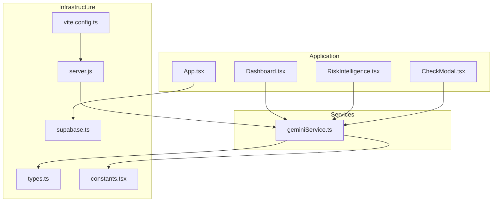
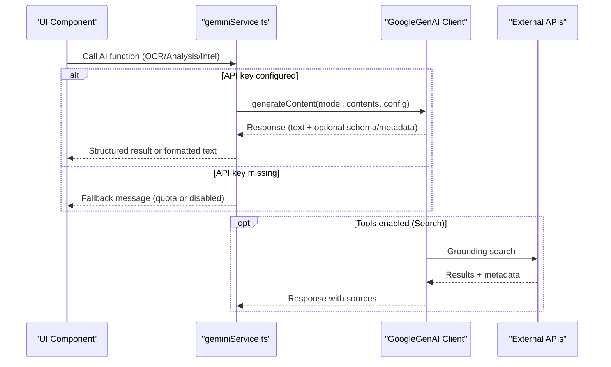
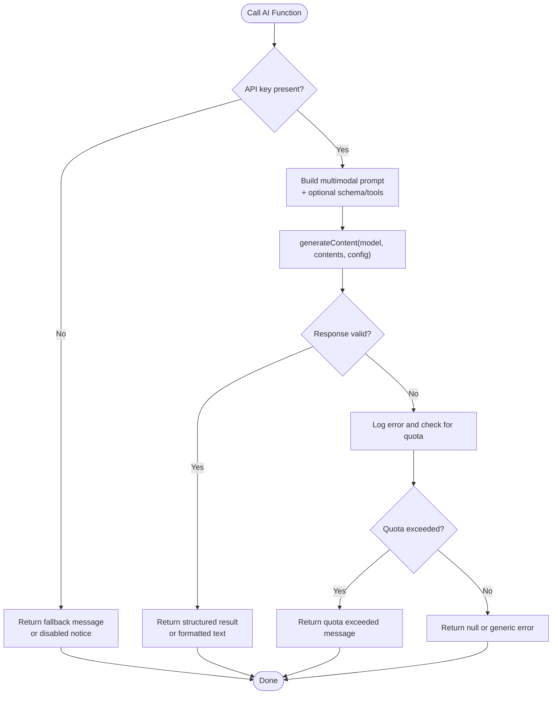
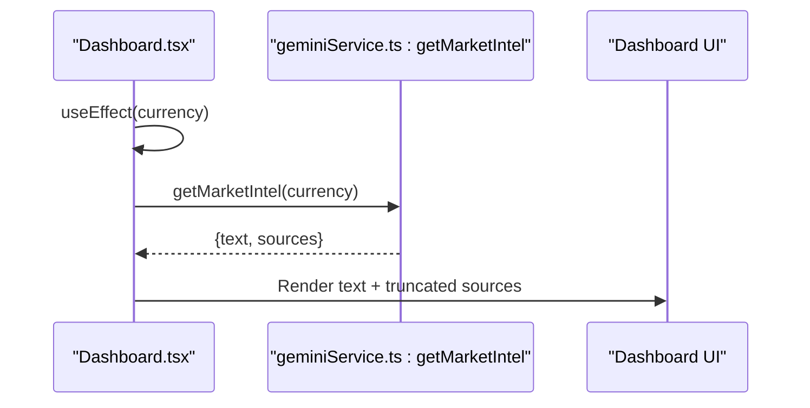
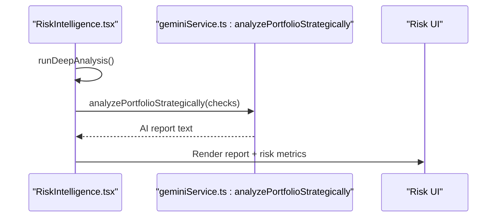
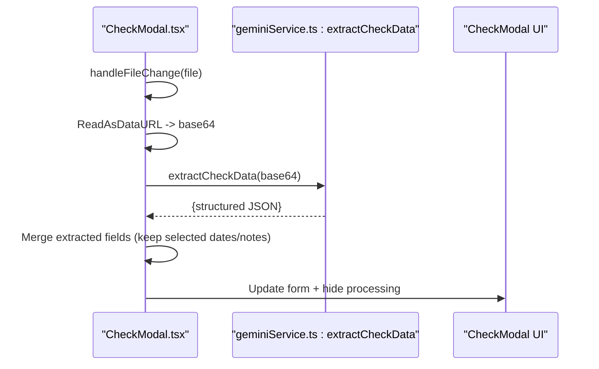
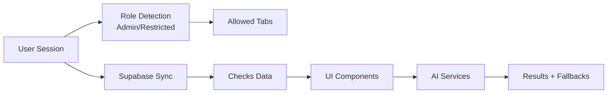
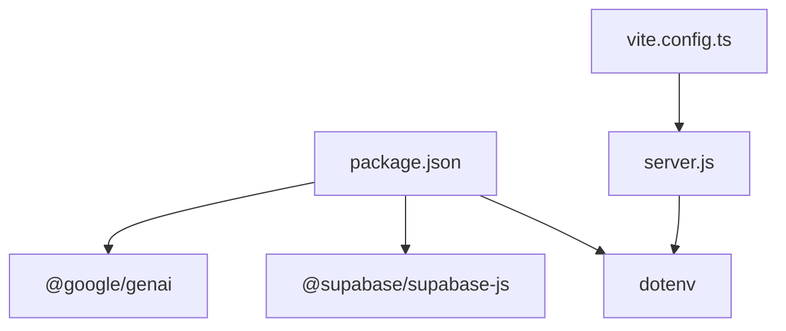

# AI Integration Services

<cite>
**Referenced Files in This Document**
- [geminiService.ts](file://services/geminiService.ts)
- [App.tsx](file://App.tsx)
- [Dashboard.tsx](file://components/Dashboard.tsx)
- [RiskIntelligence.tsx](file://components/RiskIntelligence.tsx)
- [CheckModal.tsx](file://components/CheckModal.tsx)
- [types.ts](file://types.ts)
- [constants.tsx](file://constants.tsx)
- [supabase.ts](file://supabase.ts)
- [server.js](file://server.js)
- [vite.config.ts](file://vite.config.ts)
- [package.json](file://package.json)
- [README.md](file://README.md)
</cite>

## Table of Contents
1. [Introduction](#introduction)
2. [Project Structure](#project-structure)
3. [Core Components](#core-components)
4. [Architecture Overview](#architecture-overview)
5. [Detailed Component Analysis](#detailed-component-analysis)
6. [Dependency Analysis](#dependency-analysis)
7. [Performance Considerations](#performance-considerations)
8. [Troubleshooting Guide](#troubleshooting-guide)
9. [Conclusion](#conclusion)
10. [Appendices](#appendices)

## Introduction
This document explains the AI integration services powered by Google Gemini API within the application. It covers service configuration, API key management, error handling strategies, and the multi-modal AI capabilities implemented for:
- Check image OCR extraction with structured output
- Market intelligence retrieval with grounded sources
- Strategic portfolio analysis with deep reasoning

It also documents how these AI features are integrated into the main application components, role-based access controls, quota and rate-limiting considerations, fallback strategies, and practical usage patterns.

## Project Structure
The AI services are encapsulated in a dedicated service module and consumed by UI components for dashboard analytics, risk intelligence, and check capture workflows. Environment configuration is handled via Vite and a Node.js server.

**Diagram sources**
- [geminiService.ts:1-138](file://services/geminiService.ts#L1-L138)
- [Dashboard.tsx:18](file://components/Dashboard.tsx#L18)
- [RiskIntelligence.tsx:10](file://components/RiskIntelligence.tsx#L10)
- [CheckModal.tsx:5](file://components/CheckModal.tsx#L5)
- [App.tsx:14](file://App.tsx#L14)
- [vite.config.ts:14-16](file://vite.config.ts#L14-L16)
- [server.js:62-67](file://server.js#L62-L67)
- [supabase.ts:1-23](file://supabase.ts#L1-L23)
- [types.ts:1-77](file://types.ts#L1-L77)
- [constants.tsx:1-56](file://constants.tsx#L1-L56)

**Section sources**
- [geminiService.ts:1-138](file://services/geminiService.ts#L1-L138)
- [Dashboard.tsx:18](file://components/Dashboard.tsx#L18)
- [RiskIntelligence.tsx:10](file://components/RiskIntelligence.tsx#L10)
- [CheckModal.tsx:5](file://components/CheckModal.tsx#L5)
- [App.tsx:14](file://App.tsx#L14)
- [vite.config.ts:14-16](file://vite.config.ts#L14-L16)
- [server.js:62-67](file://server.js#L62-L67)
- [supabase.ts:1-23](file://supabase.ts#L1-L23)
- [types.ts:1-77](file://types.ts#L1-L77)
- [constants.tsx:1-56](file://constants.tsx#L1-L56)

## Core Components
- geminiService.ts: Implements three primary AI capabilities:
  - OCR extraction for check images with structured JSON schema
  - Strategic portfolio analysis leveraging advanced reasoning
  - Market intelligence retrieval with Google Search grounding and source attribution
- UI integrations:
  - Dashboard.tsx: Fetches and displays market intelligence with source links
  - RiskIntelligence.tsx: Triggers deep portfolio analysis and renders AI insights
  - CheckModal.tsx: Uploads check images and performs OCR extraction to prefill form fields
- Application orchestration:
  - App.tsx: Role-based access control and data synchronization
  - supabase.ts: Authentication and data persistence
  - server.js and vite.config.ts: Environment variable injection and transpilation pipeline

**Section sources**
- [geminiService.ts:1-138](file://services/geminiService.ts#L1-L138)
- [Dashboard.tsx:18-40](file://components/Dashboard.tsx#L18-L40)
- [RiskIntelligence.tsx:10-28](file://components/RiskIntelligence.tsx#L10-L28)
- [CheckModal.tsx:5-79](file://components/CheckModal.tsx#L5-L79)
- [App.tsx:32-64](file://App.tsx#L32-L64)
- [supabase.ts:1-23](file://supabase.ts#L1-L23)
- [server.js:62-67](file://server.js#L62-L67)
- [vite.config.ts:14-16](file://vite.config.ts#L14-L16)

## Architecture Overview
The AI service layer is decoupled from UI components and relies on a centralized configuration for the Gemini client. Environment variables are injected at build-time and runtime to ensure the API key is available to the service. UI components trigger AI workflows and present results with graceful fallbacks when the API key is missing or quotas are exceeded.

**Diagram sources**
- [geminiService.ts:9-58](file://services/geminiService.ts#L9-L58)
- [geminiService.ts:63-96](file://services/geminiService.ts#L63-L96)
- [geminiService.ts:101-138](file://services/geminiService.ts#L101-L138)

## Detailed Component Analysis

### geminiService.ts: AI Service Implementation
- API key management:
  - Loads API key from environment variables and initializes the client conditionally
  - Provides fallback behavior when the key is absent
- OCR extraction:
  - Uses a multimodal model to analyze check images
  - Sends a structured prompt and enforces a JSON schema for predictable output
  - Returns parsed JSON or handles quota errors
- Strategic portfolio analysis:
  - Summarizes check records and sends a reasoning prompt to a capable model
  - Enables deep reasoning budget for extended thinking
  - Returns natural-language analysis or error messages
- Market intelligence:
  - Queries current exchange rates and local financial news
  - Leverages Google Search grounding to attach verified sources
  - Returns text and source metadata with quota-aware fallbacks

**Diagram sources**
- [geminiService.ts:3-58](file://services/geminiService.ts#L3-L58)
- [geminiService.ts:63-96](file://services/geminiService.ts#L63-L96)
- [geminiService.ts:101-138](file://services/geminiService.ts#L101-L138)

**Section sources**
- [geminiService.ts:3-58](file://services/geminiService.ts#L3-L58)
- [geminiService.ts:63-96](file://services/geminiService.ts#L63-L96)
- [geminiService.ts:101-138](file://services/geminiService.ts#L101-L138)

### Dashboard.tsx: Market Intelligence Integration
- Fetches market intelligence on mount and when currency changes
- Displays AI-generated insights and verified sources with external links
- Handles loading states and empty results gracefully

**Diagram sources**
- [Dashboard.tsx:32-40](file://components/Dashboard.tsx#L32-L40)
- [Dashboard.tsx:166-190](file://components/Dashboard.tsx#L166-L190)
- [geminiService.ts:101-138](file://services/geminiService.ts#L101-L138)

**Section sources**
- [Dashboard.tsx:32-40](file://components/Dashboard.tsx#L32-L40)
- [Dashboard.tsx:166-190](file://components/Dashboard.tsx#L166-L190)
- [geminiService.ts:101-138](file://services/geminiService.ts#L101-L138)

### RiskIntelligence.tsx: Strategic Analysis Integration
- Runs a deep portfolio analysis on demand
- Renders risk metrics and AI-generated recommendations
- Displays loading state during analysis

**Diagram sources**
- [RiskIntelligence.tsx:23-28](file://components/RiskIntelligence.tsx#L23-L28)
- [RiskIntelligence.tsx:117-135](file://components/RiskIntelligence.tsx#L117-L135)
- [geminiService.ts:63-96](file://services/geminiService.ts#L63-L96)

**Section sources**
- [RiskIntelligence.tsx:23-28](file://components/RiskIntelligence.tsx#L23-L28)
- [RiskIntelligence.tsx:117-135](file://components/RiskIntelligence.tsx#L117-L135)
- [geminiService.ts:63-96](file://services/geminiService.ts#L63-L96)

### CheckModal.tsx: OCR Data Extraction Integration
- Allows uploading a check image and triggers OCR extraction
- Prefills form fields with extracted data while preserving selected dates/notes
- Shows processing state and handles errors

**Diagram sources**
- [CheckModal.tsx:55-79](file://components/CheckModal.tsx#L55-L79)
- [CheckModal.tsx:65-75](file://components/CheckModal.tsx#L65-L75)
- [geminiService.ts:9-58](file://services/geminiService.ts#L9-L58)

**Section sources**
- [CheckModal.tsx:55-79](file://components/CheckModal.tsx#L55-L79)
- [CheckModal.tsx:65-75](file://components/CheckModal.tsx#L65-L75)
- [geminiService.ts:9-58](file://services/geminiService.ts#L9-L58)

### Role-Based Access and Data Flow
- App.tsx defines user roles and restricts navigation tabs for restricted users
- Data synchronization uses Supabase for checks and settings
- AI features are gated by API key presence and return user-friendly messages when unavailable

**Diagram sources**
- [App.tsx:32-64](file://App.tsx#L32-L64)
- [App.tsx:111-164](file://App.tsx#L111-L164)
- [supabase.ts:1-23](file://supabase.ts#L1-L23)

**Section sources**
- [App.tsx:32-64](file://App.tsx#L32-L64)
- [App.tsx:111-164](file://App.tsx#L111-L164)
- [supabase.ts:1-23](file://supabase.ts#L1-L23)

## Dependency Analysis
- External libraries:
  - @google/genai: Provides the Gemini client and multimodal generation
  - @supabase/supabase-js: Authentication and real-time data sync
  - dotenv: Loads environment variables for local development
- Build-time and runtime environment:
  - Vite injects API keys into client code
  - Node server maps environment variables and injects them into transpiled assets
- Data models:
  - types.ts defines enums and interfaces used across components and services
  - constants.tsx provides formatting utilities for currency and badges

**Diagram sources**
- [package.json:13-24](file://package.json#L13-L24)
- [vite.config.ts:14-16](file://vite.config.ts#L14-L16)
- [server.js:6-12](file://server.js#L6-L12)

**Section sources**
- [package.json:13-24](file://package.json#L13-L24)
- [vite.config.ts:14-16](file://vite.config.ts#L14-L16)
- [server.js:6-12](file://server.js#L6-L12)
- [types.ts:1-77](file://types.ts#L1-L77)
- [constants.tsx:16-32](file://constants.tsx#L16-L32)

## Performance Considerations
- Model selection:
  - OCR uses a fast multimodal model optimized for vision tasks
  - Strategic analysis uses a higher-capability model with reasoning budget
  - Market intelligence leverages grounding for up-to-date information
- Caching:
  - The server caches transpiled TypeScript/JSX to reduce repeated work
- Network efficiency:
  - UI components show loading indicators during AI requests
  - Results are rendered incrementally to improve perceived performance

[No sources needed since this section provides general guidance]

## Troubleshooting Guide
Common issues and resolutions:
- API key not configured:
  - Symptoms: AI features return disabled messages or null
  - Resolution: Set GEMINI_API_KEY in environment and restart dev server
- Quota exceeded (HTTP 429):
  - Symptoms: Quota exceeded messages returned by AI functions
  - Resolution: Wait for quota reset or upgrade plan; UI components display user-friendly messages
- Transpilation errors:
  - Symptoms: Errors logged during TS/TSX transpilation
  - Resolution: Verify environment variables and file paths; check server logs

Operational references:
- Environment variable injection and fallback mapping
- Error logging and quota detection logic in AI service functions

**Section sources**
- [server.js:6-12](file://server.js#L6-L12)
- [geminiService.ts:51-57](file://services/geminiService.ts#L51-L57)
- [geminiService.ts:89-95](file://services/geminiService.ts#L89-L95)
- [geminiService.ts:127-137](file://services/geminiService.ts#L127-L137)

## Conclusion
The AI integration services leverage Google Gemini to deliver OCR-driven data extraction, strategic financial insights, and market intelligence with source attribution. The implementation is modular, resilient, and user-focused, with clear fallbacks and role-aware UI components. Proper environment configuration and awareness of quota limits ensure reliable operation across the application’s workflows.

[No sources needed since this section summarizes without analyzing specific files]

## Appendices

### Practical Usage Examples and Patterns
- OCR extraction:
  - Triggered from the check capture modal after image upload
  - Returns structured JSON for immediate form population
- Market intelligence:
  - Called on dashboard mount and when currency changes
  - Displays AI text and clickable source links
- Strategic analysis:
  - Initiated manually from the risk intelligence panel
  - Produces a comprehensive report based on portfolio data

**Section sources**
- [CheckModal.tsx:55-79](file://components/CheckModal.tsx#L55-L79)
- [Dashboard.tsx:32-40](file://components/Dashboard.tsx#L32-L40)
- [RiskIntelligence.tsx:23-28](file://components/RiskIntelligence.tsx#L23-L28)

### Role Impact on AI Features
- Admin and restricted users:
  - Admins have broader access to dashboards and reports
  - Restricted users are limited to specific tabs but can still benefit from AI features when enabled
- Data isolation:
  - Non-admin users only see checks they created, reducing noise in AI prompts

**Section sources**
- [App.tsx:32-64](file://App.tsx#L32-L64)
- [App.tsx:128-141](file://App.tsx#L128-L141)

### Environment Setup
- Local development requires setting GEMINI_API_KEY
- The server maps GEMINI_API_KEY to API_KEY for compatibility
- Vite injects environment variables into client builds

**Section sources**
- [README.md:16-19](file://README.md#L16-L19)
- [server.js:9-12](file://server.js#L9-L12)
- [vite.config.ts:14-16](file://vite.config.ts#L14-L16)