# API Reference

<cite>
**Referenced Files in This Document**
- [server.js](file://server.js)
- [supabase.ts](file://supabase.ts)
- [geminiService.ts](file://services/geminiService.ts)
- [App.tsx](file://App.tsx)
- [Auth.tsx](file://components/Auth.tsx)
- [CheckList.tsx](file://components/CheckList.tsx)
- [CheckModal.tsx](file://components/CheckModal.tsx)
- [RiskIntelligence.tsx](file://components/RiskIntelligence.tsx)
- [Settings.tsx](file://components/Settings.tsx)
- [setup.sql](file://setup.sql)
- [types.ts](file://types.ts)
- [constants.tsx](file://constants.tsx)
- [package.json](file://package.json)
- [README.md](file://README.md)
</cite>

## Table of Contents
1. [Introduction](#introduction)
2. [Project Structure](#project-structure)
3. [Core Components](#core-components)
4. [Architecture Overview](#architecture-overview)
5. [Detailed Component Analysis](#detailed-component-analysis)
6. [Dependency Analysis](#dependency-analysis)
7. [Performance Considerations](#performance-considerations)
8. [Troubleshooting Guide](#troubleshooting-guide)
9. [Conclusion](#conclusion)
10. [Appendices](#appendices)

## Introduction
This document provides a comprehensive API reference for GestionCh-ques, focusing on:
- Supabase client usage patterns for database operations, real-time subscriptions, and authentication
- Gemini API integration endpoints and service methods for AI-powered features (OCR processing, market intelligence extraction, and strategic analysis)
- Backend API endpoints defined in server.js covering authentication routes, check management operations, and settings management
- Request/response schemas, authentication requirements, error handling patterns, and rate limiting considerations
- Supabase Realtime API integration for live data synchronization and event handling
- Practical examples, integration patterns, best practices for error handling and retry mechanisms
- API versioning, backward compatibility, and migration strategies

## Project Structure
The project is a React single-page application bundled and served via a lightweight Express server. It integrates:
- Supabase for authentication, row-level security (RLS), and database operations
- Gemini AI for OCR and advanced analytics
- A static file server with TypeScript/TSX transpilation caching

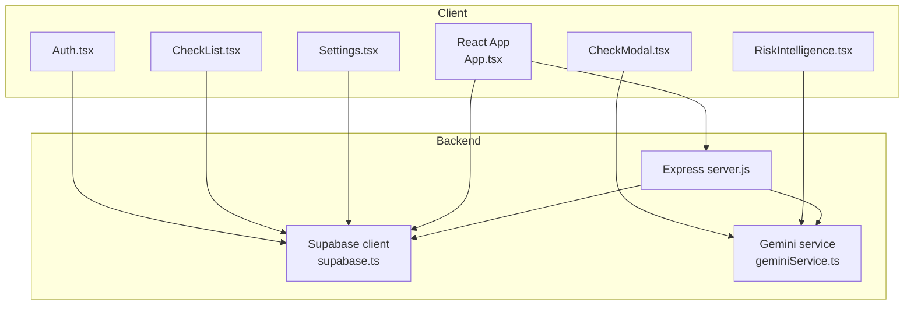

**Diagram sources**
- [server.js:1-101](file://server.js#L1-L101)
- [supabase.ts:1-23](file://supabase.ts#L1-L23)
- [geminiService.ts:1-138](file://services/geminiService.ts#L1-L138)
- [App.tsx:1-406](file://App.tsx#L1-L406)
- [Auth.tsx:1-112](file://components/Auth.tsx#L1-L112)
- [CheckList.tsx:1-350](file://components/CheckList.tsx#L1-L350)
- [CheckModal.tsx:1-311](file://components/CheckModal.tsx#L1-L311)
- [RiskIntelligence.tsx:1-141](file://components/RiskIntelligence.tsx#L1-L141)
- [Settings.tsx:1-196](file://components/Settings.tsx#L1-L196)

**Section sources**
- [server.js:1-101](file://server.js#L1-L101)
- [supabase.ts:1-23](file://supabase.ts#L1-L23)
- [geminiService.ts:1-138](file://services/geminiService.ts#L1-L138)
- [App.tsx:1-406](file://App.tsx#L1-L406)

## Core Components
- Supabase client initialization and configuration for authentication, session persistence, and global headers
- Express server handling CORS, security headers, TypeScript/TSX transpilation with caching, static serving, and SPA routing
- Gemini service module exposing OCR, portfolio analysis, and market intelligence functions
- Frontend components orchestrating Supabase queries, mutations, and real-time updates; integrating AI features

**Section sources**
- [supabase.ts:1-23](file://supabase.ts#L1-L23)
- [server.js:1-101](file://server.js#L1-L101)
- [geminiService.ts:1-138](file://services/geminiService.ts#L1-L138)
- [App.tsx:1-406](file://App.tsx#L1-L406)

## Architecture Overview
The system follows a client-server architecture:
- Client-side React app communicates with Supabase for authentication and data operations and with Gemini for AI features
- The Express server serves static assets, injects environment variables into client bundles, and acts as a development-time proxy for TypeScript/TSX transpilation

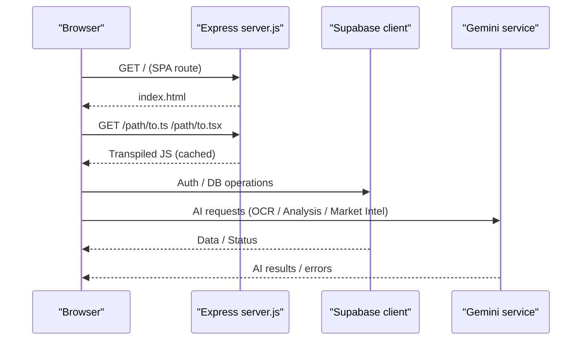

**Diagram sources**
- [server.js:37-85](file://server.js#L37-L85)
- [supabase.ts:1-23](file://supabase.ts#L1-L23)
- [geminiService.ts:1-138](file://services/geminiService.ts#L1-L138)

## Detailed Component Analysis

### Supabase Authentication and Realtime
- Initialization includes session persistence, auto-refresh, implicit flow, and custom headers
- Real-time subscription listens to auth state changes and triggers data synchronization
- Row-level security policies restrict access to user-specific records and admin/user@apollo.com privileges

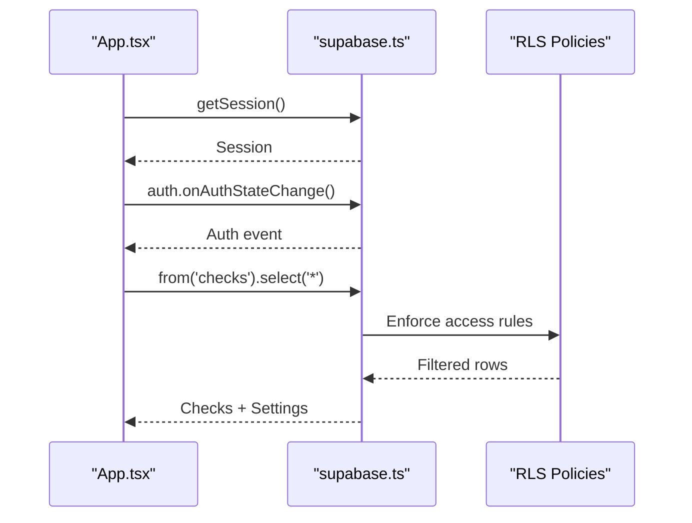

**Diagram sources**
- [App.tsx:111-120](file://App.tsx#L111-L120)
- [App.tsx:122-164](file://App.tsx#L122-L164)
- [setup.sql:46-51](file://setup.sql#L46-L51)

**Section sources**
- [supabase.ts:1-23](file://supabase.ts#L1-L23)
- [App.tsx:111-120](file://App.tsx#L111-L120)
- [App.tsx:122-164](file://App.tsx#L122-L164)
- [setup.sql:37-61](file://setup.sql#L37-L61)

### Supabase Database Operations
- Fetch checks with optional manager visibility and per-user filtering
- Upsert system settings per user with conflict resolution
- Mutations for marking as paid, batch operations, and deletions

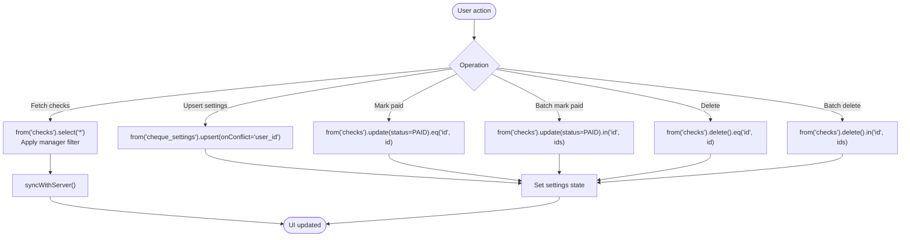

**Diagram sources**
- [App.tsx:180-237](file://App.tsx#L180-L237)
- [App.tsx:122-164](file://App.tsx#L122-L164)

**Section sources**
- [App.tsx:180-237](file://App.tsx#L180-L237)
- [App.tsx:122-164](file://App.tsx#L122-L164)

### Supabase Realtime Subscriptions
- Subscribe to auth state changes to keep session and UI synchronized
- Optional real-time subscriptions can be added for table events (e.g., checks) using Supabase’s Realtime client

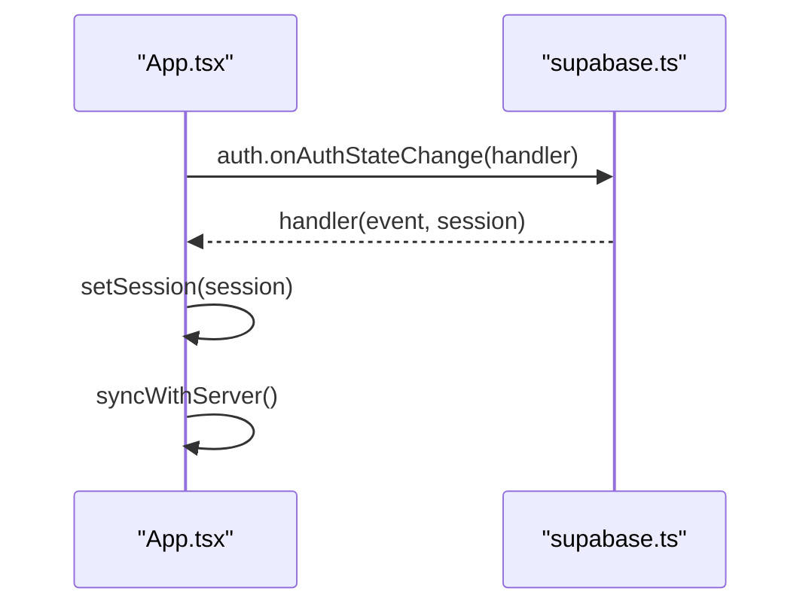

**Diagram sources**
- [App.tsx:111-120](file://App.tsx#L111-L120)

**Section sources**
- [App.tsx:111-120](file://App.tsx#L111-L120)

### Authentication Routes and UI
- Authentication form supports sign-up and sign-in with email/password
- Uses Supabase auth client and displays user feedback

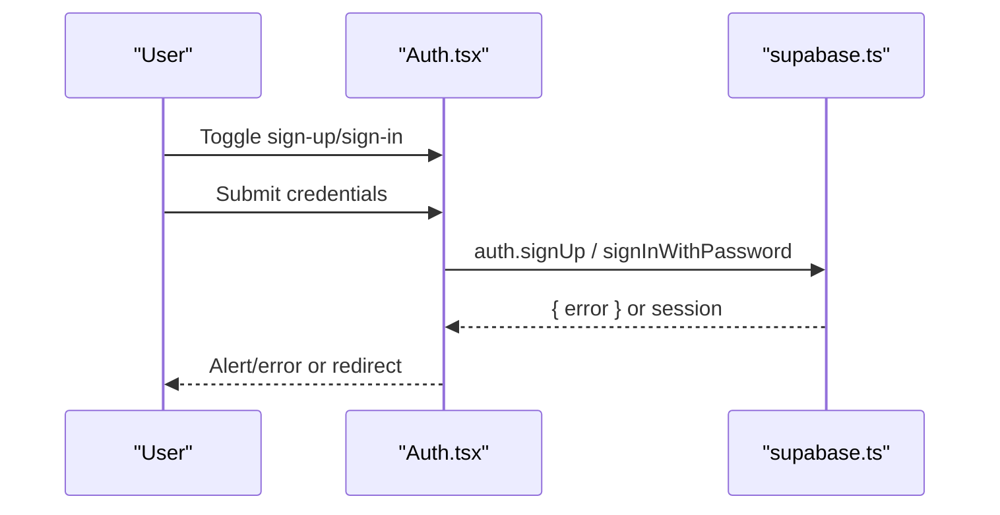

**Diagram sources**
- [Auth.tsx:12-27](file://components/Auth.tsx#L12-L27)

**Section sources**
- [Auth.tsx:12-27](file://components/Auth.tsx#L12-L27)

### Check Management UI and Data Flow
- Check list with search, filters, pagination, and batch actions
- Modal captures image, optionally runs OCR, and persists check record
- Settings panel upserts user preferences

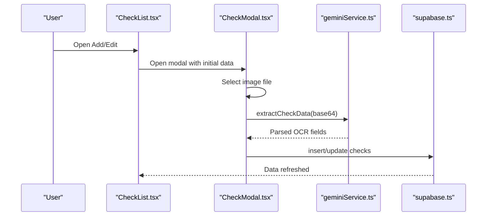

**Diagram sources**
- [CheckList.tsx:1-350](file://components/CheckList.tsx#L1-L350)
- [CheckModal.tsx:55-79](file://components/CheckModal.tsx#L55-L79)
- [geminiService.ts:9-58](file://services/geminiService.ts#L9-L58)
- [App.tsx:194-209](file://App.tsx#L194-L209)

**Section sources**
- [CheckList.tsx:1-350](file://components/CheckList.tsx#L1-L350)
- [CheckModal.tsx:55-79](file://components/CheckModal.tsx#L55-L79)
- [geminiService.ts:9-58](file://services/geminiService.ts#L9-L58)
- [App.tsx:194-209](file://App.tsx#L194-L209)

### Risk Intelligence and Strategic Analysis
- Risk scoring computed from pending overdue/high-value checks
- Deep analysis button triggers AI-driven portfolio insights

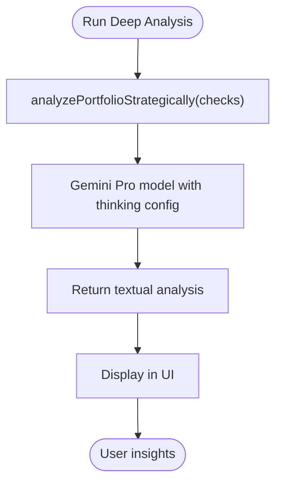

**Diagram sources**
- [RiskIntelligence.tsx:23-28](file://components/RiskIntelligence.tsx#L23-L28)
- [geminiService.ts:63-96](file://services/geminiService.ts#L63-L96)

**Section sources**
- [RiskIntelligence.tsx:23-28](file://components/RiskIntelligence.tsx#L23-L28)
- [geminiService.ts:63-96](file://services/geminiService.ts#L63-L96)

### Settings Management
- Local state mirrors persisted settings; save triggers upsert with conflict handling

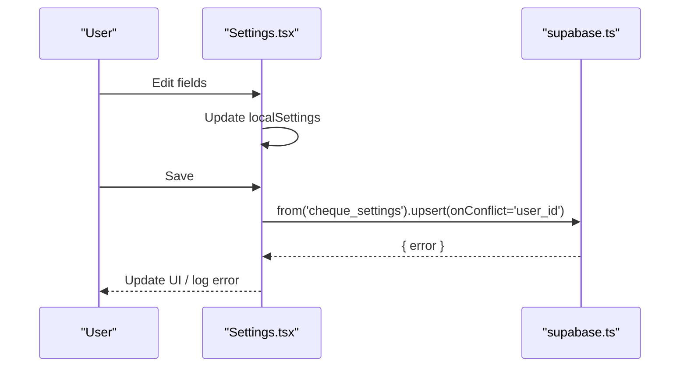

**Diagram sources**
- [Settings.tsx:31-35](file://components/Settings.tsx#L31-L35)
- [App.tsx:180-192](file://App.tsx#L180-L192)

**Section sources**
- [Settings.tsx:31-35](file://components/Settings.tsx#L31-L35)
- [App.tsx:180-192](file://App.tsx#L180-L192)

### Backend API Endpoints (server.js)
- CORS and security headers middleware
- TypeScript/TSX transpilation with in-memory cache and environment variable injection
- Static file serving and SPA fallback routing

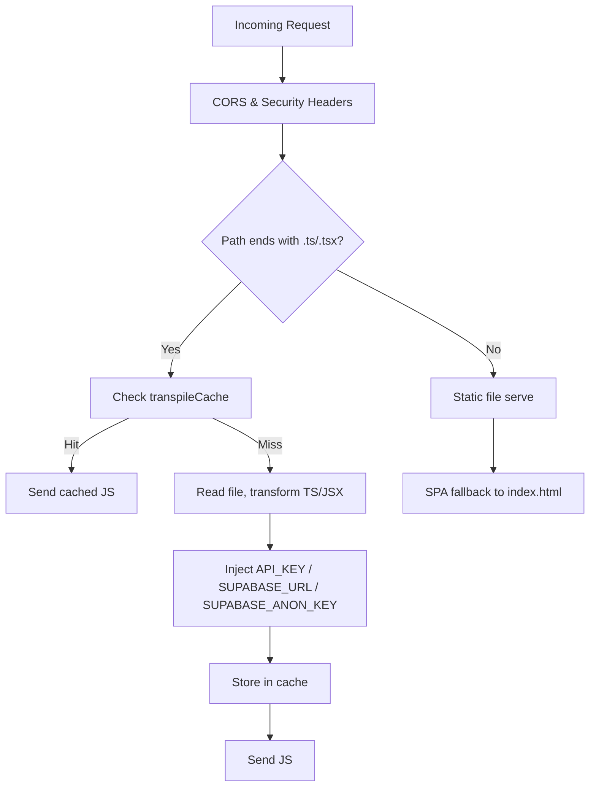

**Diagram sources**
- [server.js:26-85](file://server.js#L26-L85)

**Section sources**
- [server.js:26-85](file://server.js#L26-L85)

### Gemini API Integration Endpoints and Methods
- OCR extraction for check images using Flash model
- Strategic portfolio analysis using Pro model with thinking capabilities
- Market intelligence retrieval with grounding sources

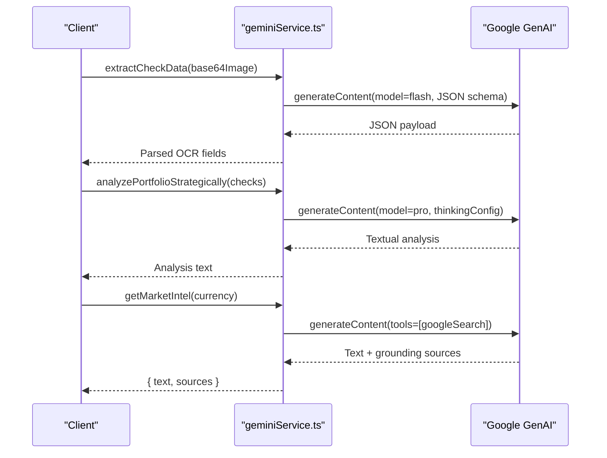

**Diagram sources**
- [geminiService.ts:9-58](file://services/geminiService.ts#L9-L58)
- [geminiService.ts:63-96](file://services/geminiService.ts#L63-L96)
- [geminiService.ts:101-138](file://services/geminiService.ts#L101-L138)

**Section sources**
- [geminiService.ts:9-58](file://services/geminiService.ts#L9-L58)
- [geminiService.ts:63-96](file://services/geminiService.ts#L63-L96)
- [geminiService.ts:101-138](file://services/geminiService.ts#L101-L138)

## Dependency Analysis
- Supabase client depends on @supabase/supabase-js and environment variables for URL and keys
- Gemini service depends on @google/genai and environment variables for API key
- Express server depends on dotenv, express, and sucrase for transpilation

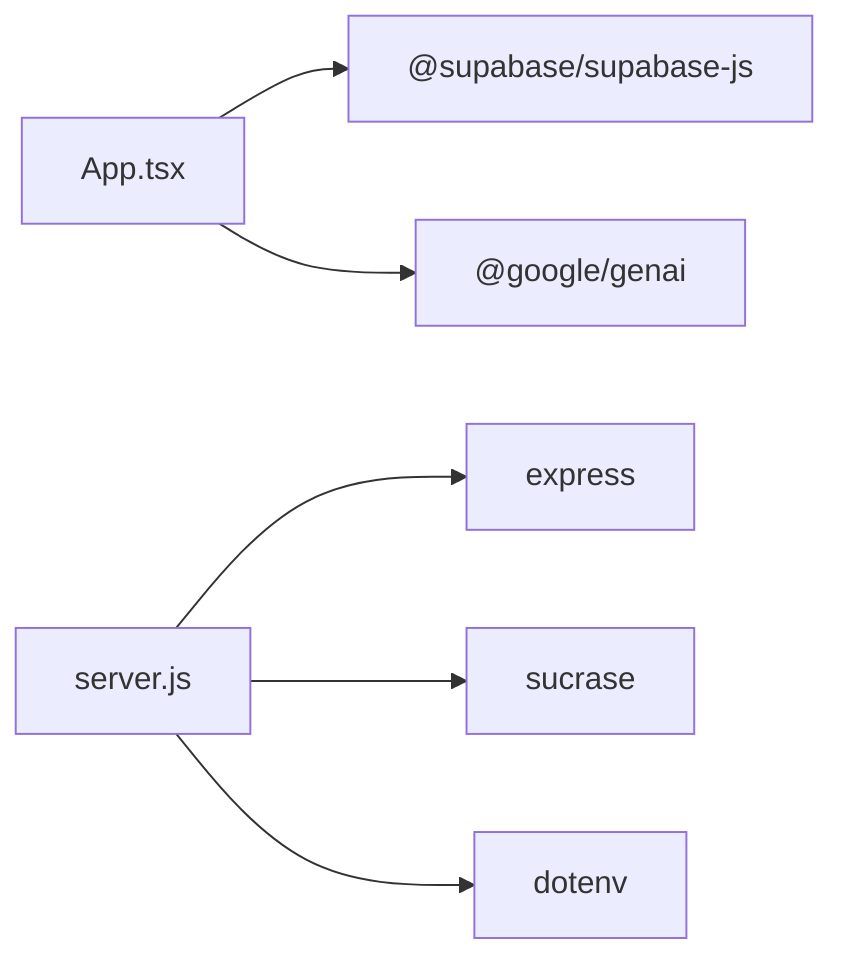

**Diagram sources**
- [package.json:13-23](file://package.json#L13-L23)
- [server.js:2-7](file://server.js#L2-L7)

**Section sources**
- [package.json:13-23](file://package.json#L13-L23)
- [server.js:2-7](file://server.js#L2-L7)

## Performance Considerations
- Transpilation caching reduces repeated TS/TSX compilation overhead
- Environment variable injection avoids runtime fetching and improves client load performance
- Use pagination and filtering to limit dataset sizes on the client
- Debounce or throttle frequent UI interactions to reduce network churn

[No sources needed since this section provides general guidance]

## Troubleshooting Guide
- Authentication failures: Verify email/password correctness and Supabase auth configuration
- Missing API keys: Ensure API_KEY or GEMINI_API_KEY is present in environment
- Rate limiting: Gemini 429 responses are handled by returning user-friendly messages
- CORS errors: Confirm Access-Control-Allow-Origin and headers are set on server
- Database errors: Check RLS policies and user permissions; inspect returned error codes

**Section sources**
- [Auth.tsx:12-27](file://components/Auth.tsx#L12-L27)
- [geminiService.ts:51-57](file://services/geminiService.ts#L51-L57)
- [geminiService.ts:89-95](file://services/geminiService.ts#L89-L95)
- [geminiService.ts:127-137](file://services/geminiService.ts#L127-L137)
- [server.js:26-35](file://server.js#L26-L35)
- [setup.sql:37-61](file://setup.sql#L37-L61)

## Conclusion
GestionCh-ques integrates Supabase for secure, real-time data management and Gemini for intelligent financial insights. The Express server provides a fast, cached transpilation pipeline for development. The frontend components demonstrate robust patterns for authentication, data synchronization, AI-assisted workflows, and settings management. Adhering to the documented schemas, authentication requirements, and error handling patterns ensures reliable operation and maintainability.

[No sources needed since this section summarizes without analyzing specific files]

## Appendices

### Data Models
```mermaid
erDiagram
CHECKS {
uuid id PK
text check_number
text bank_name
numeric amount
date issue_date
date due_date
text entity_name
text type
text status
text image_url
timestamptz created_at
text notes
text fund_name
text amount_in_words
uuid created_by FK
}
CHEQUE_SETTINGS {
uuid user_id PK FK
text company_name
text currency
text timezone
text date_format
date fiscal_start
boolean alert_before
boolean alert_delay
text alert_method
integer alert_days
text logo_url
timestamptz updated_at
}
```

**Diagram sources**
- [setup.sql:3-19](file://setup.sql#L3-L19)
- [setup.sql:21-35](file://setup.sql#L21-L35)

**Section sources**
- [setup.sql:3-19](file://setup.sql#L3-L19)
- [setup.sql:21-35](file://setup.sql#L21-L35)

### Request/Response Schemas
- Authentication
  - POST /auth/signup
    - Body: { email, password }
    - Response: { error } or session
  - POST /auth/signin
    - Body: { email, password }
    - Response: { error } or session
- Checks
  - GET /checks
    - Query: none (filters applied client-side)
    - Response: Array of Check
  - POST /checks
    - Body: Partial<Check> (with created_by injected)
    - Response: { error }
  - PUT /checks/:id
    - Body: Partial<Check>
    - Response: { error }
  - DELETE /checks/:id
    - Response: { error }
  - PUT /checks/batch/mark-paid
    - Body: { ids: string[] }
    - Response: { error }
  - DELETE /checks/batch
    - Body: { ids: string[] }
    - Response: { error }
- Settings
  - POST /settings
    - Body: SystemSettings (upsert onConflict=user_id)
    - Response: { error }

Note: The server.js does not define explicit REST endpoints. The above schemas reflect client-side Supabase usage patterns.

**Section sources**
- [App.tsx:194-237](file://App.tsx#L194-L237)
- [App.tsx:180-192](file://App.tsx#L180-L192)

### Authentication Requirements
- Supabase Auth: Implicit flow with session persistence and auto-refresh
- Supabase Headers: x-application-name header included on client initialization
- Environment Variables: SUPABASE_URL, SUPABASE_ANON_KEY, API_KEY/GEMINI_API_KEY

**Section sources**
- [supabase.ts:12-22](file://supabase.ts#L12-L22)
- [server.js:62-67](file://server.js#L62-L67)

### Error Handling Patterns
- Gemini service returns structured errors for quota exceeded (429) and generic failures
- Supabase operations propagate errors; UI components log and surface feedback
- Express transpilation errors return informative messages

**Section sources**
- [geminiService.ts:51-57](file://services/geminiService.ts#L51-L57)
- [geminiService.ts:89-95](file://services/geminiService.ts#L89-L95)
- [geminiService.ts:127-137](file://services/geminiService.ts#L127-L137)
- [App.tsx:146-148](file://App.tsx#L146-L148)
- [server.js:74-78](file://server.js#L74-L78)

### Rate Limiting Considerations
- Gemini API quota exceeded is detected and surfaced to the user
- Implement client-side retries with exponential backoff for transient failures
- Monitor API_KEY limits and consider regional quotas for sustained usage

**Section sources**
- [geminiService.ts:53-55](file://services/geminiService.ts#L53-L55)
- [geminiService.ts:91-93](file://services/geminiService.ts#L91-L93)
- [geminiService.ts:129-133](file://services/geminiService.ts#L129-L133)

### API Versioning, Backward Compatibility, and Migration Strategies
- Client version: 1.1.2 (package.json)
- Supabase RLS policies evolve with DROP/CREATE semantics; ensure migrations update policies consistently
- Gemini model names and schemas should be versioned in service methods to prevent breaking changes
- Maintain environment variable fallbacks (e.g., GEMINI_API_KEY to API_KEY) during transitions

**Section sources**
- [package.json](file://package.json#L3)
- [setup.sql:42-51](file://setup.sql#L42-L51)
- [server.js:9-12](file://server.js#L9-L12)