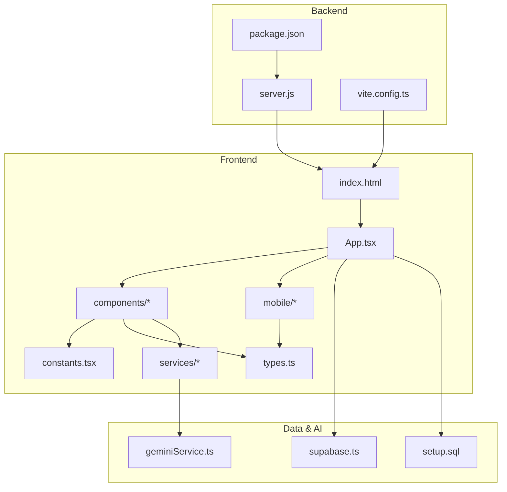
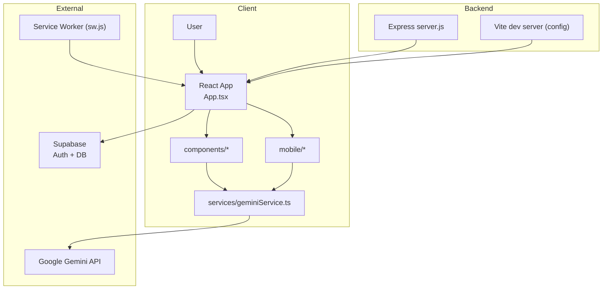
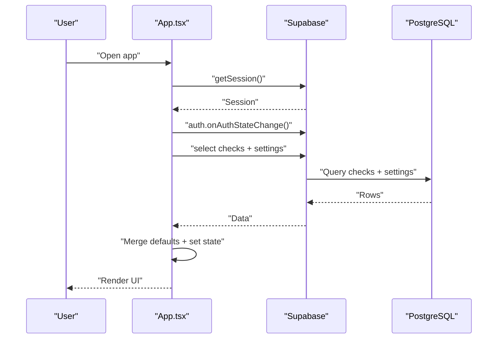
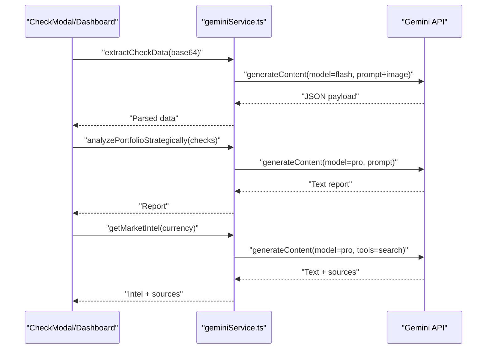
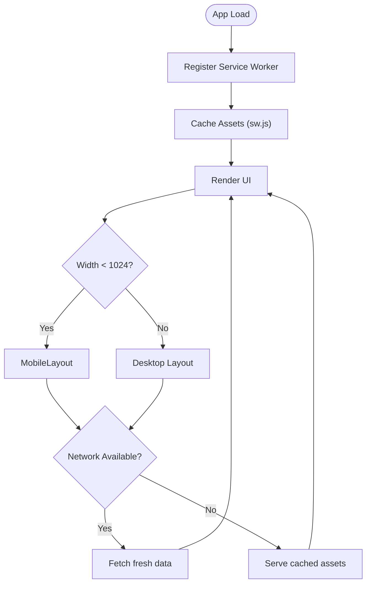
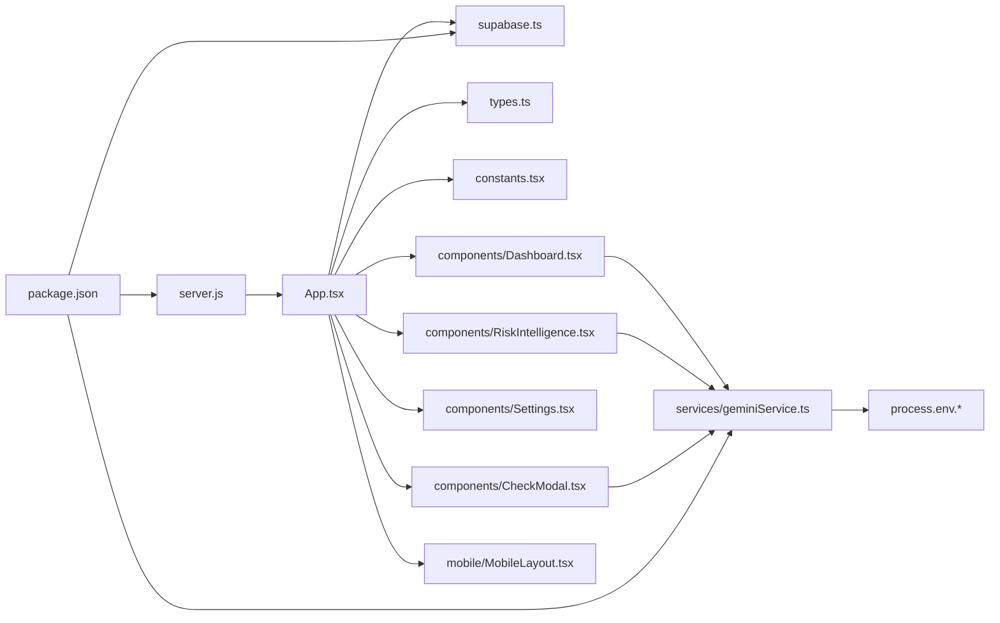

# Architecture Overview

<cite>
**Referenced Files in This Document**
- [App.tsx](file://App.tsx)
- [server.js](file://server.js)
- [supabase.ts](file://supabase.ts)
- [geminiService.ts](file://services/geminiService.ts)
- [types.ts](file://types.ts)
- [constants.tsx](file://constants.tsx)
- [components/Dashboard.tsx](file://components/Dashboard.tsx)
- [components/RiskIntelligence.tsx](file://components/RiskIntelligence.tsx)
- [components/Settings.tsx](file://components/Settings.tsx)
- [components/CheckModal.tsx](file://components/CheckModal.tsx)
- [components/Auth.tsx](file://components/Auth.tsx)
- [mobile/MobileLayout.tsx](file://mobile/MobileLayout.tsx)
- [index.html](file://index.html)
- [sw.js](file://sw.js)
- [setup.sql](file://setup.sql)
- [vite.config.ts](file://vite.config.ts)
- [package.json](file://package.json)
</cite>

## Table of Contents
1. [Introduction](#introduction)
2. [Project Structure](#project-structure)
3. [Core Components](#core-components)
4. [Architecture Overview](#architecture-overview)
5. [Detailed Component Analysis](#detailed-component-analysis)
6. [Dependency Analysis](#dependency-analysis)
7. [Performance Considerations](#performance-considerations)
8. [Troubleshooting Guide](#troubleshooting-guide)
9. [Conclusion](#conclusion)
10. [Appendices](#appendices)

## Introduction
This document presents the architecture of the GestionCh-ques system, a premium financial management platform for check instrument tracking and risk intelligence. The system comprises:
- A React frontend with TypeScript and TailwindCSS styling
- An Express.js server for development-time transpilation and static hosting
- Supabase for authentication, row-level security, and relational data storage
- Google Gemini AI services for OCR, market intelligence, and deep portfolio analysis
- Progressive Web App (PWA) capabilities for offline resilience and mobile responsiveness

The central orchestrator is App.tsx, which coordinates authentication, state management, routing, and real-time data synchronization with Supabase. AI services are integrated via dedicated service modules and invoked from UI components to enrich functionality.

## Project Structure
The project follows a feature-based layout with clear separation of concerns:
- Frontend entry and root component: App.tsx, index.html
- Components: feature-specific UI modules under components/
- Mobile variants: mobile/ for responsive layouts
- Services: AI integrations under services/
- Backend: server.js for development-time transpilation and static hosting
- Supabase client initialization and database schema: supabase.ts, setup.sql
- Shared types and constants: types.ts, constants.tsx
- PWA assets: sw.js, index.html
- Build and runtime configuration: vite.config.ts, package.json



**Diagram sources**
- [index.html](file://index.html)
- [App.tsx](file://App.tsx)
- [components/Dashboard.tsx](file://components/Dashboard.tsx)
- [components/RiskIntelligence.tsx](file://components/RiskIntelligence.tsx)
- [components/Settings.tsx](file://components/Settings.tsx)
- [components/CheckModal.tsx](file://components/CheckModal.tsx)
- [components/Auth.tsx](file://components/Auth.tsx)
- [mobile/MobileLayout.tsx](file://mobile/MobileLayout.tsx)
- [server.js](file://server.js)
- [vite.config.ts](file://vite.config.ts)
- [package.json](file://package.json)
- [supabase.ts](file://supabase.ts)
- [setup.sql](file://setup.sql)
- [geminiService.ts](file://services/geminiService.ts)
- [types.ts](file://types.ts)
- [constants.tsx](file://constants.tsx)

**Section sources**
- [index.html](file://index.html)
- [App.tsx](file://App.tsx)
- [server.js](file://server.js)
- [supabase.ts](file://supabase.ts)
- [setup.sql](file://setup.sql)
- [geminiService.ts](file://services/geminiService.ts)
- [types.ts](file://types.ts)
- [constants.tsx](file://constants.tsx)
- [vite.config.ts](file://vite.config.ts)
- [package.json](file://package.json)

## Core Components
- App.tsx: Central orchestrator managing authentication state, active tab routing, sidebar state, checks and settings synchronization, notifications, and device responsiveness. It conditionally renders Desktop or Mobile layouts and integrates Supabase for auth/session and data queries.
- Supabase client: Provides authentication hooks, session lifecycle, and database operations for checks and settings.
- Gemini AI services: OCR extraction, strategic portfolio analysis, and market intelligence retrieval.
- UI components: Dashboard, RiskIntelligence, Settings, CheckModal, and Auth encapsulate domain logic and presentables.
- MobileLayout: Responsive navigation and simplified content rendering for mobile devices.
- Express server: Development-time TypeScript/JSX transpilation with caching, static hosting, SPA routing, and environment injection.

Key responsibilities:
- Authentication and session persistence
- Real-time-like data synchronization via periodic polling and visibility-driven refresh
- Device-aware rendering and navigation
- AI-powered data extraction and insights
- PWA caching and offline-first behavior

**Section sources**
- [App.tsx](file://App.tsx)
- [supabase.ts](file://supabase.ts)
- [geminiService.ts](file://services/geminiService.ts)
- [components/Dashboard.tsx](file://components/Dashboard.tsx)
- [components/RiskIntelligence.tsx](file://components/RiskIntelligence.tsx)
- [components/Settings.tsx](file://components/Settings.tsx)
- [components/CheckModal.tsx](file://components/CheckModal.tsx)
- [components/Auth.tsx](file://components/Auth.tsx)
- [mobile/MobileLayout.tsx](file://mobile/MobileLayout.tsx)
- [server.js](file://server.js)

## Architecture Overview
High-level system boundaries:
- Internal boundary: React frontend, Express server, shared types/constants
- External boundaries: Supabase (authentication, database, row-level security), Google Gemini API

Data flow patterns:
- Authentication flow: Supabase auth state change triggers App.tsx to synchronize user session and data.
- Data synchronization: App.tsx queries checks and settings, applies row-level security policies, and updates local state.
- AI integration: Components invoke services that call Gemini APIs for OCR and analytics.
- PWA behavior: Service worker caches critical assets; app remains usable when offline.



**Diagram sources**
- [App.tsx](file://App.tsx)
- [components/Dashboard.tsx](file://components/Dashboard.tsx)
- [components/RiskIntelligence.tsx](file://components/RiskIntelligence.tsx)
- [components/CheckModal.tsx](file://components/CheckModal.tsx)
- [mobile/MobileLayout.tsx](file://mobile/MobileLayout.tsx)
- [geminiService.ts](file://services/geminiService.ts)
- [server.js](file://server.js)
- [supabase.ts](file://supabase.ts)
- [sw.js](file://sw.js)

## Detailed Component Analysis

### App.tsx Orchestration
Responsibilities:
- Authentication lifecycle: initialize session, subscribe to auth state changes, sign out
- Data synchronization: fetch checks and settings, apply row-level security, update state
- State management: active tab, sidebar collapse, notifications, modal state, editing context
- Device responsiveness: detect viewport and render Desktop or Mobile layouts
- Event handlers: save/update/delete checks, batch operations, mark as paid, save settings

Real-time data synchronization:
- On mount and visibility change, App.tsx synchronizes with Supabase
- For managers (admin or restricted user), fetches all checks; otherwise filters by created_by
- Settings are upserted per user and merged with defaults



**Diagram sources**
- [App.tsx](file://App.tsx)
- [supabase.ts](file://supabase.ts)
- [setup.sql](file://setup.sql)

**Section sources**
- [App.tsx](file://App.tsx)
- [supabase.ts](file://supabase.ts)
- [setup.sql](file://setup.sql)

### Supabase Integration and Row-Level Security
- Client initialization with persistent sessions and custom headers
- Auth state subscription and session management
- Database schema with checks and cheque_settings tables
- Row-level security policies allowing managers broad access and restricting regular users to their own records

```mermaid
erDiagram
USERS {
uuid id PK
}
CHECKS {
uuid id PK
text check_number
text bank_name
numeric amount
date issue_date
date due_date
text entity_name
text type
text status
text image_url
timestamptz created_at
text notes
text fund_name
text amount_in_words
uuid created_by FK
}
CHEQUE_SETTINGS {
uuid user_id PK FK
text company_name
text currency
text timezone
text date_format
date fiscal_start
boolean alert_before
boolean alert_delay
text alert_method
int alert_days
text logo_url
timestamptz updated_at
}
USERS ||--o{ CHECKS : "owns"
USERS ||--o{ CHEQUE_SETTINGS : "has"
```

**Diagram sources**
- [setup.sql](file://setup.sql)
- [supabase.ts](file://supabase.ts)

**Section sources**
- [supabase.ts](file://supabase.ts)
- [setup.sql](file://setup.sql)

### AI Integration Layer (Google Gemini)
Services:
- OCR extraction: converts check images to structured JSON using a preview model
- Strategic analysis: deep portfolio analysis using a reasoning model
- Market intelligence: current exchange rates and financial news grounded via Google Search



**Diagram sources**
- [components/CheckModal.tsx](file://components/CheckModal.tsx)
- [components/Dashboard.tsx](file://components/Dashboard.tsx)
- [components/RiskIntelligence.tsx](file://components/RiskIntelligence.tsx)
- [geminiService.ts](file://services/geminiService.ts)

**Section sources**
- [geminiService.ts](file://services/geminiService.ts)
- [components/CheckModal.tsx](file://components/CheckModal.tsx)
- [components/Dashboard.tsx](file://components/Dashboard.tsx)
- [components/RiskIntelligence.tsx](file://components/RiskIntelligence.tsx)

### Progressive Web App and Mobile Responsiveness
- PWA: Service worker caches key assets and serves them offline; app registers the worker on load
- Mobile layout: Dedicated bottom navigation with integrated actions; simplified tabs and modals
- Responsive design: Tailwind utilities and viewport meta tag; device detection drives layout selection



**Diagram sources**
- [index.html](file://index.html)
- [sw.js](file://sw.js)
- [mobile/MobileLayout.tsx](file://mobile/MobileLayout.tsx)
- [App.tsx](file://App.tsx)

**Section sources**
- [index.html](file://index.html)
- [sw.js](file://sw.js)
- [mobile/MobileLayout.tsx](file://mobile/MobileLayout.tsx)
- [App.tsx](file://App.tsx)

## Dependency Analysis
Internal dependencies:
- App.tsx depends on Supabase client, types, constants, and routes components
- Components depend on types and constants for presentation and formatting
- Services depend on environment variables for API keys and external libraries

External dependencies:
- Supabase JS client for auth and database
- Google GenAI SDK for AI services
- Express for development-time transpilation and static hosting
- Vite for build-time environment injection and dev server



**Diagram sources**
- [App.tsx](file://App.tsx)
- [supabase.ts](file://supabase.ts)
- [types.ts](file://types.ts)
- [constants.tsx](file://constants.tsx)
- [components/Dashboard.tsx](file://components/Dashboard.tsx)
- [components/RiskIntelligence.tsx](file://components/RiskIntelligence.tsx)
- [components/Settings.tsx](file://components/Settings.tsx)
- [components/CheckModal.tsx](file://components/CheckModal.tsx)
- [mobile/MobileLayout.tsx](file://mobile/MobileLayout.tsx)
- [geminiService.ts](file://services/geminiService.ts)
- [server.js](file://server.js)
- [package.json](file://package.json)

**Section sources**
- [package.json](file://package.json)
- [server.js](file://server.js)
- [App.tsx](file://App.tsx)
- [supabase.ts](file://supabase.ts)
- [geminiService.ts](file://services/geminiService.ts)
- [types.ts](file://types.ts)
- [constants.tsx](file://constants.tsx)

## Performance Considerations
- Transpilation caching: Express server caches transpiled TypeScript/JSX to reduce latency during development
- Environment injection: Build-time injection of API keys avoids runtime overhead and reduces bundle size
- Local state and memoization: Components compute derived data efficiently and avoid unnecessary re-renders
- PWA caching: Service worker improves perceived performance and enables offline usage

[No sources needed since this section provides general guidance]

## Troubleshooting Guide
Common issues and resolutions:
- Supabase configuration: Verify URL and anonymous key; ensure auth persistence is enabled
- Authentication state: Confirm auth state listener is active and session is persisted
- AI quota errors: Handle 429 responses gracefully and inform users to retry later
- PWA caching: Clear browser cache or unregister service worker if stale assets cause issues
- Environment variables: Ensure API keys are present in both server and Vite configurations

**Section sources**
- [supabase.ts](file://supabase.ts)
- [server.js](file://server.js)
- [geminiService.ts](file://services/geminiService.ts)
- [vite.config.ts](file://vite.config.ts)

## Conclusion
GestionCh-ques combines a modern React frontend with Express-based development tooling, robust Supabase authentication and data management, and powerful Google Gemini AI services. App.tsx orchestrates authentication, state, routing, and real-time-like synchronization, while components deliver specialized functionality. The PWA stack ensures resilience and mobile-first usability, and the modular architecture supports maintainability and scalability.

[No sources needed since this section summarizes without analyzing specific files]

## Appendices

### System Boundaries and Integration Points
- Internal: React components, services, shared types/constants
- External: Supabase (auth + Postgres), Google Gemini API, browser environment
- Integration points: Supabase client hooks, Gemini service wrappers, Express transpiler, Vite environment injection

**Section sources**
- [supabase.ts](file://supabase.ts)
- [geminiService.ts](file://services/geminiService.ts)
- [server.js](file://server.js)
- [vite.config.ts](file://vite.config.ts)
- [package.json](file://package.json)