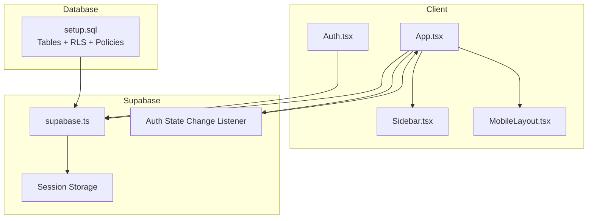
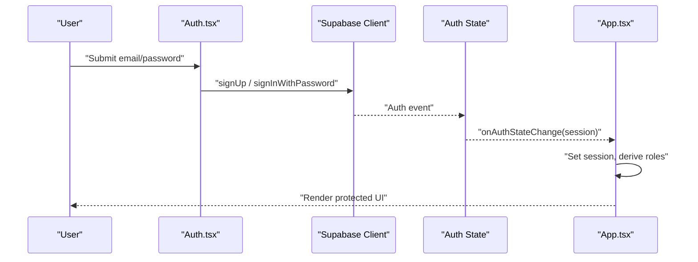
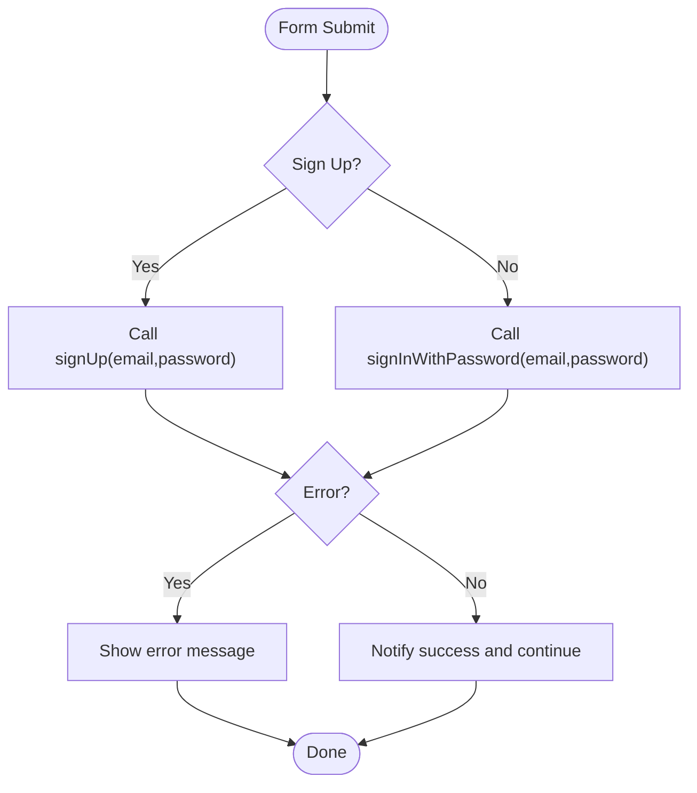
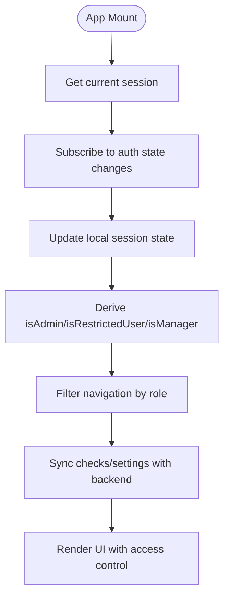
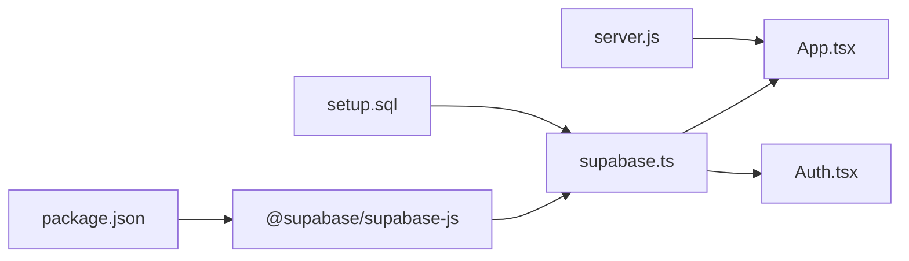

# Authentication and Authorization

<cite>
**Referenced Files in This Document**
- [supabase.ts](file://supabase.ts)
- [App.tsx](file://App.tsx)
- [Auth.tsx](file://components/Auth.tsx)
- [Sidebar.tsx](file://components/Sidebar.tsx)
- [MobileLayout.tsx](file://mobile/MobileLayout.tsx)
- [setup.sql](file://setup.sql)
- [types.ts](file://types.ts)
- [constants.tsx](file://constants.tsx)
- [server.js](file://server.js)
- [package.json](file://package.json)
</cite>

## Table of Contents
1. [Introduction](#introduction)
2. [Project Structure](#project-structure)
3. [Core Components](#core-components)
4. [Architecture Overview](#architecture-overview)
5. [Detailed Component Analysis](#detailed-component-analysis)
6. [Dependency Analysis](#dependency-analysis)
7. [Performance Considerations](#performance-considerations)
8. [Troubleshooting Guide](#troubleshooting-guide)
9. [Conclusion](#conclusion)

## Introduction
This document explains the authentication and authorization system built with Supabase. It covers user registration and login, session lifecycle management, JWT-based access control, row-level security policies, and UI integration across desktop and mobile views. It also documents how the main application state integrates with Supabase to enforce permissions and maintain secure access to features.

## Project Structure
The authentication system spans client-side initialization, UI components, and database policies:
- Supabase client initialization and session persistence
- Authentication UI component for sign-up and sign-in
- Application shell that reacts to auth state changes and enforces access control
- Row-level security policies and access control logic
- Mobile layout with simplified navigation based on roles



**Diagram sources**
- [supabase.ts:12-22](file://supabase.ts#L12-L22)
- [App.tsx:111-120](file://App.tsx#L111-L120)
- [Auth.tsx:12-27](file://components/Auth.tsx#L12-L27)
- [setup.sql:37-61](file://setup.sql#L37-L61)

**Section sources**
- [supabase.ts:12-22](file://supabase.ts#L12-L22)
- [App.tsx:111-120](file://App.tsx#L111-L120)
- [Auth.tsx:12-27](file://components/Auth.tsx#L12-L27)
- [setup.sql:37-61](file://setup.sql#L37-L61)

## Core Components
- Supabase client with session persistence and token refresh
- Auth UI component for sign-up/sign-in
- App shell that subscribes to auth state changes and controls feature visibility
- Role-based helpers derived from session email
- Database RLS policies for checks and settings tables

Key implementation references:
- Session persistence and auth config: [supabase.ts:12-22](file://supabase.ts#L12-L22)
- Auth form submission: [Auth.tsx:12-27](file://components/Auth.tsx#L12-L27)
- Auth state subscription and session-driven routing: [App.tsx:111-120](file://App.tsx#L111-L120)
- Role derivation and manager flag: [App.tsx:49-54](file://App.tsx#L49-L54)
- RLS policies for checks and settings: [setup.sql:46-60](file://setup.sql#L46-L60)

**Section sources**
- [supabase.ts:12-22](file://supabase.ts#L12-L22)
- [Auth.tsx:12-27](file://components/Auth.tsx#L12-L27)
- [App.tsx:49-54](file://App.tsx#L49-L54)
- [App.tsx:111-120](file://App.tsx#L111-L120)
- [setup.sql:46-60](file://setup.sql#L46-L60)

## Architecture Overview
The system uses Supabase Auth for identity and JWTs, with the client subscribing to auth state changes to drive UI and data access. Access control is enforced both in the UI (based on user email) and in the database via RLS policies.



**Diagram sources**
- [Auth.tsx:12-27](file://components/Auth.tsx#L12-L27)
- [App.tsx:111-120](file://App.tsx#L111-L120)
- [supabase.ts:12-22](file://supabase.ts#L12-L22)

## Detailed Component Analysis

### Supabase Client Initialization and Session Management
- Initializes the Supabase client with explicit auth options:
  - Persist session across browser reloads
  - Auto-refresh tokens
  - Detect sessions in URL fragments
  - Implicit OAuth flow type
- Adds a custom header for application identification.

Implementation references:
- Client creation and auth options: [supabase.ts:12-22](file://supabase.ts#L12-L22)

Security and behavior implications:
- Session persistence ensures seamless UX after reloads.
- Auto-refresh reduces friction during long sessions.
- Implicit flow aligns with SPA patterns.

**Section sources**
- [supabase.ts:12-22](file://supabase.ts#L12-L22)

### Authentication UI: Sign-Up and Login
- Single form toggling between sign-up and sign-in modes.
- Submits credentials to Supabase Auth.
- Provides basic feedback on success/error.

Implementation references:
- Form submission handler: [Auth.tsx:12-27](file://components/Auth.tsx#L12-L27)



**Diagram sources**
- [Auth.tsx:12-27](file://components/Auth.tsx#L12-L27)

**Section sources**
- [Auth.tsx:12-27](file://components/Auth.tsx#L12-L27)

### App Shell: Auth State Subscription and Feature Control
- On mount, retrieves the current session and subscribes to auth state changes.
- Derives roles from the session’s user email:
  - Admin: specific email
  - Restricted user: another specific email
  - Manager: admin OR restricted user
- Applies role-based navigation filtering in the sidebar and mobile layout.
- Controls access to dashboard, reports, and settings tabs for non-admin users.
- Syncs data with the backend respecting manager vs. user scopes.

Implementation references:
- Auth state subscription: [App.tsx:111-120](file://App.tsx#L111-L120)
- Role derivation and manager flag: [App.tsx:49-54](file://App.tsx#L49-L54)
- Sidebar role-based menu filtering: [Sidebar.tsx:56-69](file://components/Sidebar.tsx#L56-L69)
- Mobile layout role-based visibility: [MobileLayout.tsx:48-56](file://mobile/MobileLayout.tsx#L48-L56)
- Data sync respecting manager flag: [App.tsx:126-141](file://App.tsx#L126-L141)



**Diagram sources**
- [App.tsx:111-120](file://App.tsx#L111-L120)
- [App.tsx:49-54](file://App.tsx#L49-L54)
- [Sidebar.tsx:56-69](file://components/Sidebar.tsx#L56-L69)
- [MobileLayout.tsx:48-56](file://mobile/MobileLayout.tsx#L48-L56)
- [App.tsx:126-141](file://App.tsx#L126-L141)

**Section sources**
- [App.tsx:49-54](file://App.tsx#L49-L54)
- [App.tsx:111-120](file://App.tsx#L111-L120)
- [Sidebar.tsx:56-69](file://components/Sidebar.tsx#L56-L69)
- [MobileLayout.tsx:48-56](file://mobile/MobileLayout.tsx#L48-L56)
- [App.tsx:126-141](file://App.tsx#L126-L141)

### Role-Based Access Control and Policies
- Roles:
  - Admin: full access
  - Restricted user: limited access to specific areas
  - Manager: can view all checks (admin or restricted user)
- Database policies:
  - Checks table: users can access their own records or are granted access by manager emails
  - Settings table: users can manage their own settings or admins can manage all

Implementation references:
- Policy for checks: [setup.sql:46-51](file://setup.sql#L46-L51)
- Policy for settings: [setup.sql:56-60](file://setup.sql#L56-L60)

```mermaid
erDiagram
AUTH_USERS {
uuid id PK
}
CHECKS {
uuid id PK
uuid created_by FK
text check_number
text bank_name
numeric amount
date issue_date
date due_date
text entity_name
text type
text status
text image_url
text notes
text fund_name
text amount_in_words
timestamptz created_at
}
CHEQUE_SETTINGS {
uuid user_id PK FK
text company_name
text currency
text timezone
text date_format
date fiscal_start
boolean alert_before
boolean alert_delay
text alert_method
int alert_days
text logo_url
timestamptz updated_at
}
AUTH_USERS ||--o{ CHECKS : "creates"
AUTH_USERS ||--|| CHEQUE_SETTINGS : "owns"
```

**Diagram sources**
- [setup.sql:3-19](file://setup.sql#L3-L19)
- [setup.sql:21-35](file://setup.sql#L21-L35)

**Section sources**
- [setup.sql:46-51](file://setup.sql#L46-L51)
- [setup.sql:56-60](file://setup.sql#L56-L60)

### Mobile Layout Integration
- Adapts navigation and visibility based on user role.
- Restricts dashboard tab for restricted users while enabling checks, risks, and due pages.

Implementation references:
- Role-based visibility: [MobileLayout.tsx:48-56](file://mobile/MobileLayout.tsx#L48-L56)

**Section sources**
- [MobileLayout.tsx:48-56](file://mobile/MobileLayout.tsx#L48-L56)

### Data Fetching and Access Control Enforcement
- Manager users can fetch all checks; non-managers are scoped to their own records.
- Settings are upserted per user ID.

Implementation references:
- Manager-scoped checks query: [App.tsx:130-132](file://App.tsx#L130-L132)
- Settings upsert: [App.tsx:183-187](file://App.tsx#L183-L187)

**Section sources**
- [App.tsx:130-132](file://App.tsx#L130-L132)
- [App.tsx:183-187](file://App.tsx#L183-L187)

## Dependency Analysis
- Supabase client depends on @supabase/supabase-js.
- App and Auth components depend on the Supabase client.
- Policies depend on auth metadata (uid and jwt email claims).
- Server-side transpilation injects environment variables into client code.



**Diagram sources**
- [package.json:13-24](file://package.json#L13-L24)
- [supabase.ts:2](file://supabase.ts#L2)
- [App.tsx:14](file://App.tsx#L14)
- [Auth.tsx:3](file://components/Auth.tsx#L3)
- [setup.sql:1-2](file://setup.sql#L1-L2)
- [server.js:62-67](file://server.js#L62-L67)

**Section sources**
- [package.json:13-24](file://package.json#L13-L24)
- [server.js:62-67](file://server.js#L62-L67)

## Performance Considerations
- Session persistence avoids repeated logins across page reloads.
- Auto-refresh keeps tokens valid without manual intervention.
- Filtering by role in the UI prevents unnecessary network requests for unauthorized routes.
- RLS policies ensure database-level filtering, reducing payload sizes and preventing accidental exposure.

[No sources needed since this section provides general guidance]

## Troubleshooting Guide
Common issues and resolutions:
- Session not restored after reload
  - Verify session persistence is enabled and cookies/localStorage are accessible.
  - Reference: [supabase.ts:14-15](file://supabase.ts#L14-L15)
- Login fails immediately or shows generic errors
  - Ensure credentials are correct and Supabase project keys are valid.
  - Reference: [Auth.tsx:12-27](file://components/Auth.tsx#L12-L27)
- Unauthorized access to dashboard or reports
  - Confirm user email matches admin/restricted role expectations.
  - Reference: [App.tsx:49-54](file://App.tsx#L49-L54), [Sidebar.tsx:56-69](file://components/Sidebar.tsx#L56-L69)
- Checks not visible for non-admin users
  - Confirm the user’s session ID matches the record’s created_by field.
  - Reference: [App.tsx:130-132](file://App.tsx#L130-L132), [setup.sql:46-51](file://setup.sql#L46-L51)
- Settings not updating
  - Ensure user_id matches the session and upsert is targeting the correct column.
  - Reference: [App.tsx:183-187](file://App.tsx#L183-L187), [setup.sql:56-60](file://setup.sql#L56-L60)
- Environment variables missing in client
  - Server injects environment variables during transpilation; confirm server is running and injecting keys.
  - Reference: [server.js:62-67](file://server.js#L62-L67)

**Section sources**
- [supabase.ts:14-15](file://supabase.ts#L14-L15)
- [Auth.tsx:12-27](file://components/Auth.tsx#L12-L27)
- [App.tsx:49-54](file://App.tsx#L49-L54)
- [Sidebar.tsx:56-69](file://components/Sidebar.tsx#L56-L69)
- [App.tsx:130-132](file://App.tsx#L130-L132)
- [setup.sql:46-51](file://setup.sql#L46-L51)
- [App.tsx:183-187](file://App.tsx#L183-L187)
- [setup.sql:56-60](file://setup.sql#L56-L60)
- [server.js:62-67](file://server.js#L62-L67)

## Conclusion
The authentication and authorization system leverages Supabase Auth for identity, JWTs for access control, and RLS for database-level enforcement. The UI integrates auth state changes to dynamically adjust navigation and feature availability, while the backend enforces strict scoping of data access. Together, these layers provide a robust, secure foundation for managing user sessions and permissions across desktop and mobile experiences.