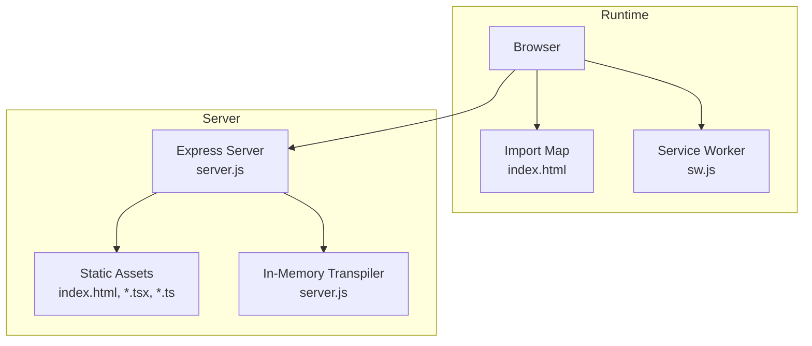
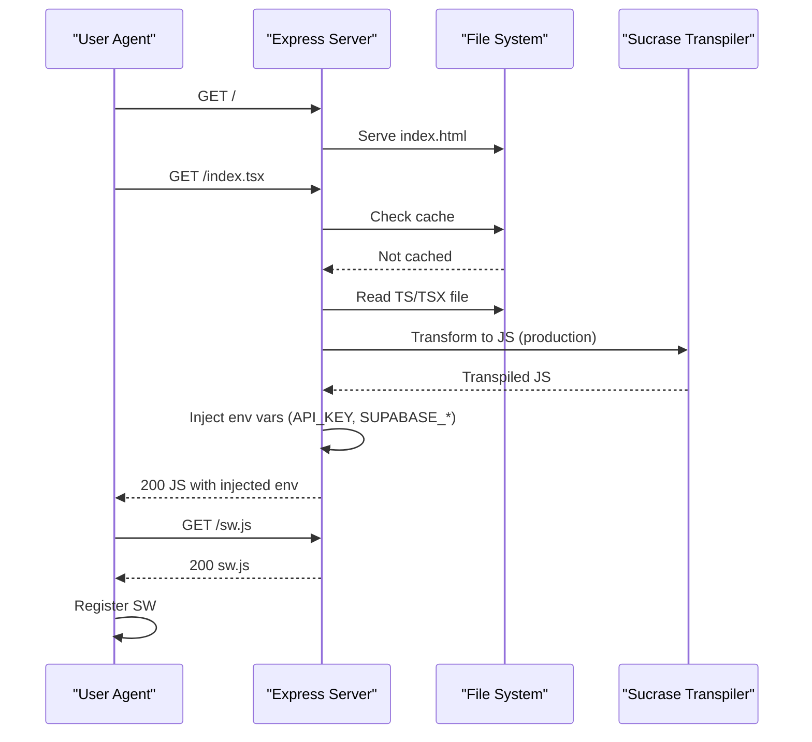

# Build and Deployment

<cite>
**Referenced Files in This Document**
- [vite.config.ts](file://vite.config.ts)
- [server.js](file://server.js)
- [package.json](file://package.json)
- [sw.js](file://sw.js)
- [index.html](file://index.html)
- [index.tsx](file://index.tsx)
- [App.tsx](file://App.tsx)
- [supabase.ts](file://supabase.ts)
- [setup.sql](file://setup.sql)
- [types.ts](file://types.ts)
- [README.md](file://README.md)
</cite>

## Table of Contents
1. [Introduction](#introduction)
2. [Project Structure](#project-structure)
3. [Core Components](#core-components)
4. [Architecture Overview](#architecture-overview)
5. [Detailed Component Analysis](#detailed-component-analysis)
6. [Dependency Analysis](#dependency-analysis)
7. [Performance Considerations](#performance-considerations)
8. [Troubleshooting Guide](#troubleshooting-guide)
9. [Conclusion](#conclusion)
10. [Appendices](#appendices)

## Introduction
This document explains how to build and deploy the GestionCh-ques application. It covers Vite configuration for development and production, the Express.js server for production deployment, environment variable injection, static file serving, and API routing. It also documents the Progressive Web App setup via the service worker, offline caching behavior, and deployment strategies for production. Guidance is included for build performance, asset optimization, and CDN integration, along with troubleshooting steps for common build and deployment issues.

## Project Structure
The application is a React single-page application served by an Express.js server. Vite is used during development. The runtime loads modules via import maps and registers a service worker for basic offline behavior.

**Diagram sources**
- [index.html:49-64](file://index.html#L49-L64)
- [server.js:37-85](file://server.js#L37-L85)
- [sw.js:12-27](file://sw.js#L12-L27)

**Section sources**
- [index.html:1-79](file://index.html#L1-L79)
- [server.js:14-100](file://server.js#L14-L100)
- [package.json:6-9](file://package.json#L6-L9)

## Core Components
- Vite configuration defines the development server, plugin pipeline, environment variable injection, and path aliases.
- Express server handles CORS/security headers, TypeScript/JSX transpilation with caching, static file serving, SPA routing, and logs requests.
- Service worker precaches selected assets and serves them from cache after installation.
- Application bootstrapping uses import maps and mounts the React root.
- Supabase client is configured for authentication and database access.

**Section sources**
- [vite.config.ts:5-23](file://vite.config.ts#L5-L23)
- [server.js:14-100](file://server.js#L14-L100)
- [sw.js:1-28](file://sw.js#L1-L28)
- [index.html:49-76](file://index.html#L49-L76)
- [supabase.ts:10-22](file://supabase.ts#L10-L22)

## Architecture Overview
The runtime architecture relies on import maps to load modern ES modules from CDNs, reducing local bundle size. The Express server acts as both a static file server and a transpiler for TypeScript/JSX files, injecting environment variables at runtime. A minimal service worker precaches core assets and attempts network-first fetching.

**Diagram sources**
- [server.js:37-85](file://server.js#L37-L85)
- [index.html:68-76](file://index.html#L68-L76)
- [sw.js:12-27](file://sw.js#L12-L27)

## Detailed Component Analysis

### Vite Configuration (vite.config.ts)
- Development server: Host and port are configured for local development.
- Plugin pipeline: React plugin is enabled.
- Environment injection: Gemini API key is injected into the client build via define.
- Path alias: '@' resolves to the project root for convenient imports.

Optimization and environment highlights:
- Environment variable injection ensures the client receives the API key at build time.
- Using a CDN for React and related packages reduces Vite’s build overhead during development.

**Section sources**
- [vite.config.ts:5-23](file://vite.config.ts#L5-L23)

### Express Server (server.js)
Responsibilities:
- Logging middleware for request tracing.
- Security and CORS headers middleware.
- In-memory transpilation with caching for .ts/.tsx routes.
- Static file serving for production distribution.
- SPA fallback routing to index.html for client-side navigation.
- Environment variable fallback: API_KEY can be sourced from GEMINI_API_KEY if not present.

Transpilation specifics:
- Uses Sucrase to transform TypeScript and JSX in production.
- Injects environment variables into the transpiled code before sending to clients.
- Caches transpiled files in memory keyed by file path.

Security and headers:
- Sets CORS headers and security headers (e.g., X-Content-Type-Options, X-Frame-Options).
- Responds 200 to OPTIONS preflight requests.

SPA routing:
- Serves index.html for any route that does not contain a file extension or ends with .html.
- Returns 404 for routes containing a dot but not ending with .html.

Port binding:
- Listens on 0.0.0.0 for containerized deployments.

**Section sources**
- [server.js:14-100](file://server.js#L14-L100)

### Service Worker (sw.js)
Behavior:
- Installs a cache named for the app version.
- Precaches a curated list of URLs including the root and several source files.
- Implements a network-first fetch strategy; falls back to cache on network failure.

Offline behavior:
- Provides cached assets when offline, enabling partial offline availability.

**Section sources**
- [sw.js:1-28](file://sw.js#L1-L28)

### Application Boot (index.html, index.tsx, App.tsx)
- index.html configures Tailwind, fonts, import maps, and registers the service worker.
- index.tsx mounts the React root and renders App.
- App.tsx orchestrates layout, tabs, notifications, and integrates Supabase for authentication and data.

Environment injection:
- The HTML sets a default NODE_ENV for the browser runtime.
- The Express server injects environment variables into transpiled client code.

**Section sources**
- [index.html:17-19](file://index.html#L17-L19)
- [index.html:49-76](file://index.html#L49-L76)
- [index.tsx:1-17](file://index.tsx#L1-L17)
- [App.tsx:32-406](file://App.tsx#L32-L406)

### Supabase Client (supabase.ts)
- Initializes the Supabase client with a fixed project URL and anonymous key.
- Enables session persistence and token refresh.
- Adds a custom header for identification.

**Section sources**
- [supabase.ts:10-22](file://supabase.ts#L10-L22)

### Database Setup (setup.sql)
- Creates the checks and cheque_settings tables with appropriate constraints and defaults.
- Enables Row Level Security (RLS).
- Defines policies allowing administrators and specific users to access data.

**Section sources**
- [setup.sql:1-61](file://setup.sql#L1-L61)

### Types and Constants (types.ts, constants.tsx)
- Defines enums and interfaces for checks, statuses, currencies, and notifications.
- Provides formatting helpers and badge renderers.

**Section sources**
- [types.ts:1-77](file://types.ts#L1-L77)
- [constants.tsx:1-56](file://constants.tsx#L1-L56)

## Dependency Analysis
- Runtime dependencies include React, React DOM, Lucide icons, Recharts, Supabase client, dotenv, Express, and Sucrase.
- Dev dependencies include Vite and @vitejs/plugin-react.
- Engines require Node.js >= 18.

Scripts:
- dev: starts Vite for development.
- start: runs the Express server for production.

**Section sources**
- [package.json:13-28](file://package.json#L13-L28)
- [package.json:6-12](file://package.json#L6-L12)

## Performance Considerations
- Import maps reduce local bundling overhead by loading React and libraries from CDNs.
- Express transpiler caches transpiled files in memory to avoid repeated work.
- Service worker precaches core assets to improve cold-start and offline readiness.
- Environment variable injection occurs at transpile time, avoiding dynamic runtime lookups.

Recommendations:
- For production builds, consider generating a static build with Vite and serving via Express static middleware to leverage compression and gzip.
- Integrate a CDN for static assets and cache-bust with hashed filenames.
- Use HTTP/2 or HTTP/3 for improved multiplexing and reduced latency.
- Monitor transpile cache hit rate and tune caching strategy if needed.

[No sources needed since this section provides general guidance]

## Troubleshooting Guide
Common build and deployment issues:

- Missing environment variables
  - Ensure API keys are present in environment configuration. The server falls back from API_KEY to GEMINI_API_KEY if needed.
  - Verify .env files are loaded in the correct order and accessible to the server process.

- Transpilation errors
  - The server catches transpilation failures and responds with a 500 containing an error message. Check server logs for details.

- 404 on static routes
  - Routes containing a dot but not ending with .html are rejected. Ensure asset paths are correct and served by the static middleware.

- SPA routing issues
  - The server routes unmatched routes to index.html. Confirm that the SPA router handles the route properly.

- Service worker not caching assets
  - Verify sw.js is served and registered. Check browser devtools Application tab for cache storage and network tab for fetch behavior.

- Supabase connectivity
  - Confirm the Supabase URL and anonymous key are correct and reachable from the deployment environment.

**Section sources**
- [server.js:9-12](file://server.js#L9-L12)
- [server.js:74-78](file://server.js#L74-L78)
- [server.js:91-96](file://server.js#L91-L96)
- [sw.js:12-27](file://sw.js#L12-L27)
- [supabase.ts:5-6](file://supabase.ts#L5-L6)

## Conclusion
GestionCh-ques combines a modern client runtime powered by import maps with a lightweight Express server that serves static assets and transpiles TypeScript/JSX on demand. The service worker provides basic offline support. With proper environment configuration and optional CDN integration, the stack delivers a fast, maintainable deployment model suitable for production.

[No sources needed since this section summarizes without analyzing specific files]

## Appendices

### A. Environment Variables and Injection
- Client-side injection: Vite injects Gemini API key into the build; Express injects API_KEY, SUPABASE_URL, and SUPABASE_ANON_KEY into transpiled code.
- Server-side fallback: API_KEY can be sourced from GEMINI_API_KEY if not explicitly set.

**Section sources**
- [vite.config.ts:13-16](file://vite.config.ts#L13-L16)
- [server.js:62-67](file://server.js#L62-L67)
- [server.js:9-12](file://server.js#L9-L12)

### B. Deployment Checklist
- Prepare environment files (.env and .env.local) with required keys.
- Build the client (optional if using import maps) and ensure static assets are available.
- Start the server with the production script.
- Verify SPA routing, transpilation, and service worker registration.

**Section sources**
- [README.md:16-20](file://README.md#L16-L20)
- [package.json:7-8](file://package.json#L7-L8)