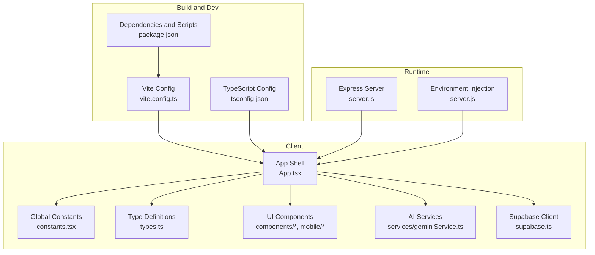
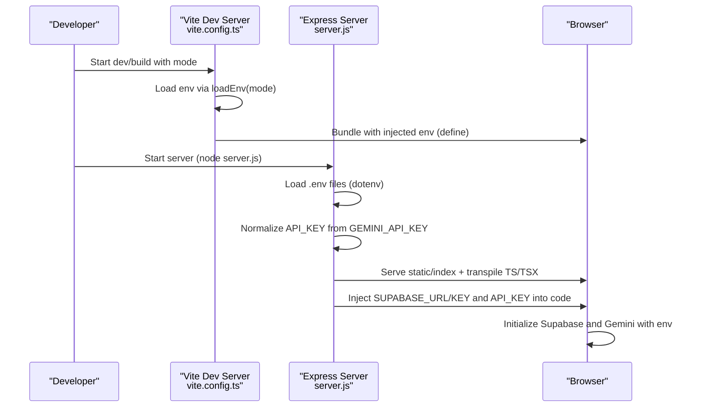
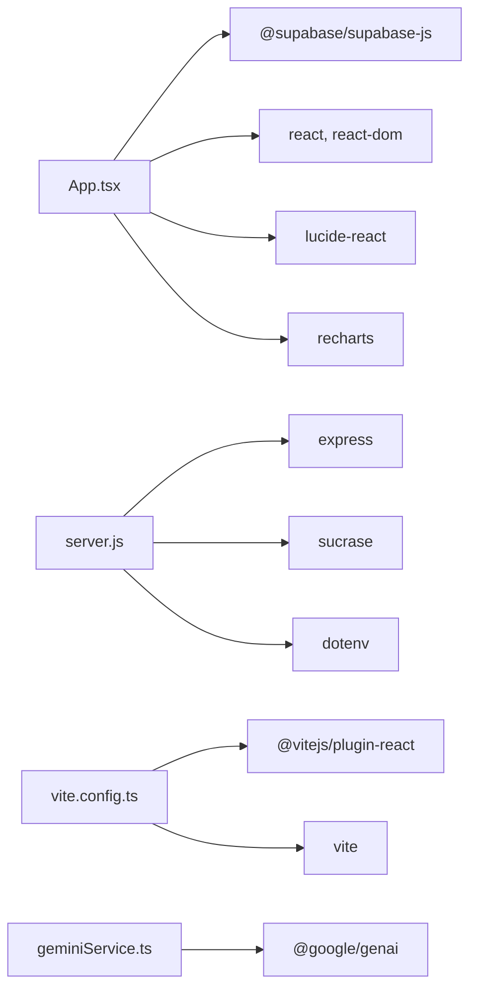

# Configuration and Customization

<cite>
**Referenced Files in This Document**
- [package.json](file://package.json)
- [tsconfig.json](file://tsconfig.json)
- [vite.config.ts](file://vite.config.ts)
- [server.js](file://server.js)
- [constants.tsx](file://constants.tsx)
- [types.ts](file://types.ts)
- [supabase.ts](file://supabase.ts)
- [App.tsx](file://App.tsx)
- [Settings.tsx](file://components/Settings.tsx)
- [Dashboard.tsx](file://components/Dashboard.tsx)
- [MobileLayout.tsx](file://mobile/MobileLayout.tsx)
- [geminiService.ts](file://services/geminiService.ts)
</cite>

## Table of Contents
1. [Introduction](#introduction)
2. [Project Structure](#project-structure)
3. [Core Components](#core-components)
4. [Architecture Overview](#architecture-overview)
5. [Detailed Component Analysis](#detailed-component-analysis)
6. [Dependency Analysis](#dependency-analysis)
7. [Performance Considerations](#performance-considerations)
8. [Troubleshooting Guide](#troubleshooting-guide)
9. [Conclusion](#conclusion)
10. [Appendices](#appendices)

## Introduction
This document explains how to configure and customize GestionCh-ques, focusing on environment configuration for AI services, database connectivity, TypeScript settings, global constants, styling and theming, responsive design, extension points, performance tuning, and deployment considerations. It consolidates configuration flows across the build pipeline, runtime server, and client application.

## Project Structure
The project is a React application bundled with Vite and served via a lightweight Node/Express server. Configuration is centralized in environment variables and shared constants, with Supabase providing backend data and authentication.

**Diagram sources**
- [vite.config.ts:1-24](file://vite.config.ts#L1-L24)
- [tsconfig.json:1-29](file://tsconfig.json#L1-L29)
- [package.json:1-30](file://package.json#L1-L30)
- [server.js:1-101](file://server.js#L1-L101)
- [App.tsx:1-406](file://App.tsx#L1-L406)
- [constants.tsx:1-56](file://constants.tsx#L1-L56)
- [types.ts:1-77](file://types.ts#L1-L77)
- [geminiService.ts:1-138](file://services/geminiService.ts#L1-L138)
- [supabase.ts:1-23](file://supabase.ts#L1-L23)

**Section sources**
- [package.json:1-30](file://package.json#L1-L30)
- [tsconfig.json:1-29](file://tsconfig.json#L1-L29)
- [vite.config.ts:1-24](file://vite.config.ts#L1-L24)
- [server.js:1-101](file://server.js#L1-L101)

## Core Components
- Environment configuration and injection:
  - Vite injects environment variables into the client bundle for API keys and feature flags.
  - The server reads environment files and injects variables into transpiled client code.
- AI service configuration:
  - Gemini API key is read from environment variables and used by the Gemini service.
- Database configuration:
  - Supabase client is initialized with explicit credentials and authentication preferences.
- Global constants and types:
  - Shared constants (colors, formatters) and TypeScript types define cross-cutting behavior and data contracts.
- Theming and styling:
  - Tailwind-based theme tokens and color palette are defined centrally and consumed by components.
- Responsive design:
  - Breakpoint-driven rendering switches between desktop and mobile layouts.

**Section sources**
- [vite.config.ts:13-16](file://vite.config.ts#L13-L16)
- [server.js:62-67](file://server.js#L62-L67)
- [geminiService.ts:3-4](file://services/geminiService.ts#L3-L4)
- [supabase.ts:5-22](file://supabase.ts#L5-L22)
- [constants.tsx:5-32](file://constants.tsx#L5-L32)
- [types.ts:2-24](file://types.ts#L2-L24)
- [App.tsx:47](file://App.tsx#L47)

## Architecture Overview
The configuration architecture spans build-time and runtime layers. Build-time configuration defines how environment variables reach the client. Runtime configuration controls how the server serves and transforms assets, while the client consumes environment variables and shared constants.

**Diagram sources**
- [vite.config.ts:5-16](file://vite.config.ts#L5-L16)
- [server.js:6-12](file://server.js#L6-L12)
- [server.js:62-67](file://server.js#L62-L67)

## Detailed Component Analysis

### Environment Configuration and Feature Flags
- Vite define injection:
  - The build injects API key variables into the client bundle so the client can initialize AI services without exposing secrets.
- Server-side environment injection:
  - The server normalizes API keys and injects environment variables into transpiled client code before serving.
- Feature flags:
  - There are no explicit feature flags in the codebase. To add flags, define environment variables and gate logic similarly to how API keys are handled.

Customization steps:
- Add new environment variables in .env files and ensure they are loaded by dotenv.
- Extend Vite’s define block to expose new variables to the client.
- Extend the server’s injection logic to replace placeholders in transpiled code.

**Section sources**
- [vite.config.ts:13-16](file://vite.config.ts#L13-L16)
- [server.js:6-12](file://server.js#L6-L12)
- [server.js:62-67](file://server.js#L62-L67)

### API Key Management for Gemini Integration
- Client initialization:
  - The Gemini service reads API keys from environment variables and guards calls when keys are absent.
- Server fallback:
  - The server ensures API_KEY is present by copying GEMINI_API_KEY if needed.

Customization steps:
- Set the Gemini API key via environment variables recognized by both Vite and the server.
- Add quota handling and retry logic around AI calls if needed.

**Section sources**
- [geminiService.ts:3-4](file://services/geminiService.ts#L3-L4)
- [geminiService.ts:53-56](file://services/geminiService.ts#L53-L56)
- [server.js:9-12](file://server.js#L9-L12)

### Database Connection Settings (Supabase)
- Supabase client initialization:
  - The client is created with explicit URL and anonymous key, with authentication persistence and headers configured.
- Authentication and session handling:
  - The app subscribes to auth state changes and synchronizes data accordingly.

Customization steps:
- Replace Supabase project URL and keys with your own.
- Adjust auth flow settings (e.g., implicit vs. PKCE) and headers as needed.

**Section sources**
- [supabase.ts:5-22](file://supabase.ts#L5-L22)
- [App.tsx:112-120](file://App.tsx#L112-L120)

### TypeScript Configuration and Type Extensions
- Compiler options:
  - ESNext modules, DOM libs, JSX transform, bundler module resolution, and path aliases are configured.
- Path aliases:
  - The @ alias resolves to the project root for clean imports.

Customization steps:
- Add new path aliases under compilerOptions.paths.
- Introduce custom type declarations by augmenting types.ts or adding ambient declarations in a dedicated .d.ts file.

**Section sources**
- [tsconfig.json:2-28](file://tsconfig.json#L2-L28)
- [types.ts:1-77](file://types.ts#L1-L77)

### Global Constants and Formatting (constants.tsx)
- Color palette and theming tokens:
  - Centralized color definitions for backgrounds, cards, and semantic accents.
- Formatting utilities:
  - Currency formatter supports multiple locales and rounding.
- Status and type badges:
  - Badge components for check statuses and types.

Customization steps:
- Modify color values to align with brand guidelines.
- Extend formatCurrency for additional locales or formatting options.
- Add new badge variants or status types by updating enums and formatter functions.

**Section sources**
- [constants.tsx:5-32](file://constants.tsx#L5-L32)
- [constants.tsx:34-55](file://constants.tsx#L34-L55)
- [types.ts:2-24](file://types.ts#L2-L24)

### Styling, Theming, and Responsive Design
- Theming:
  - Tailwind-based classes define glass cards, borders, shadows, and color accents.
- Responsive breakpoints:
  - Desktop/mobile layout switching occurs at a 1024px width threshold.
- Component-level responsiveness:
  - Grid layouts and navigation adapt using responsive Tailwind utilities.

Customization steps:
- Adjust breakpoint thresholds in App.tsx and component layouts.
- Extend color tokens in constants.tsx and apply consistently across components.
- Use Tailwind utilities to introduce new component variants and spacing scales.

**Section sources**
- [App.tsx:47](file://App.tsx#L47)
- [App.tsx:256-274](file://App.tsx#L256-L274)
- [MobileLayout.tsx:44-84](file://mobile/MobileLayout.tsx#L44-L84)

### Settings and Feature Flagging
- System settings:
  - Company branding, defaults, and notification preferences are stored per user and synchronized with Supabase.
- Notification toggles:
  - Interactive toggles manage alert preferences with immediate UI feedback.

Customization steps:
- Add new settings fields to SystemSettings and update the Settings component UI.
- Persist new settings via Supabase upsert and read them in App.tsx.

**Section sources**
- [types.ts:62-74](file://types.ts#L62-L74)
- [Settings.tsx:11-35](file://components/Settings.tsx#L11-L35)
- [App.tsx:180-192](file://App.tsx#L180-L192)

### Extension Points and Integrations
- Adding new AI services:
  - Follow the Gemini pattern: read API keys from environment, wrap service calls with error handling, and surface results in UI.
- Extending data models:
  - Add new enums or interfaces in types.ts and update components and Supabase tables accordingly.
- UI extensions:
  - Create new components under components/ or mobile/, and wire them into App.tsx routing.

**Section sources**
- [geminiService.ts:63-96](file://services/geminiService.ts#L63-L96)
- [types.ts:26-77](file://types.ts#L26-L77)
- [App.tsx:334-390](file://App.tsx#L334-L390)

### Performance Tuning and Caching Strategies
- Build-time:
  - Vite bundling with JSX transform and module resolution improves startup speed.
- Runtime:
  - The server caches transpiled TypeScript/TSX code in memory to reduce repeated transpilation overhead.
- Client-side:
  - Local storage persists UI state and reduces re-fetching on reload.

Customization steps:
- Increase cache TTL or size if needed.
- Add CDN caching headers for static assets.
- Consider lazy-loading heavy components and deferring non-critical data fetching.

**Section sources**
- [server.js:17-18](file://server.js#L17-L18)
- [server.js:37-85](file://server.js#L37-L85)
- [App.tsx:66-72](file://App.tsx#L66-L72)

## Dependency Analysis
The configuration relies on a small set of external libraries and services. Dependencies are declared in package.json and used across the build and runtime layers.

**Diagram sources**
- [package.json:13-28](file://package.json#L13-L28)
- [server.js:2-5](file://server.js#L2-L5)
- [vite.config.ts:1-3](file://vite.config.ts#L1-L3)
- [geminiService.ts:1](file://services/geminiService.ts#L1)

**Section sources**
- [package.json:13-28](file://package.json#L13-L28)

## Performance Considerations
- Environment variable propagation:
  - Ensure only necessary variables are injected to minimize bundle size.
- Transpilation caching:
  - Keep the in-memory cache warm during development; consider disk caching for production builds.
- UI rendering:
  - Memoize derived computations and avoid unnecessary re-renders in dashboard and lists.
- Network requests:
  - Debounce or batch API calls to Supabase and Gemini to reduce latency and quota usage.

[No sources needed since this section provides general guidance]

## Troubleshooting Guide
- Missing API key:
  - Symptoms: AI features disabled with warnings; quota errors surfaced to users.
  - Resolution: Set API key in environment and ensure both Vite and server recognize it.
- Supabase connectivity:
  - Symptoms: Auth state not detected; settings/checks not loading.
  - Resolution: Verify Supabase URL and keys; confirm network access and CORS settings.
- Transpilation errors:
  - Symptoms: 500 response for TS/TSX files.
  - Resolution: Check server logs; ensure Sucrase transforms match the source files.
- Quota exceeded:
  - Symptoms: Error messages indicating quota exceeded for AI services.
  - Resolution: Wait until quota resets or upgrade plan; add retry/backoff logic.

**Section sources**
- [geminiService.ts:10-13](file://services/geminiService.ts#L10-L13)
- [geminiService.ts:53-56](file://services/geminiService.ts#L53-L56)
- [server.js:74-78](file://server.js#L74-L78)
- [supabase.ts:10](file://supabase.ts#L10)

## Conclusion
GestionCh-ques provides a clear configuration surface through environment variables, centralized constants, and a minimal server that injects variables into the client. By following the established patterns—defining environment variables, injecting them at build/runtime, and centralizing shared types and styles—you can safely extend functionality, integrate additional AI services, and tailor the application to diverse business and deployment needs.

[No sources needed since this section summarizes without analyzing specific files]

## Appendices

### Environment Variables Reference
- API_KEY or GEMINI_API_KEY:
  - Used by the Gemini service for OCR, portfolio analysis, and market intelligence.
- SUPABASE_URL, SUPABASE_ANON_KEY:
  - Supabase project credentials used by the client.
- PORT:
  - Server port (default 3000).

**Section sources**
- [vite.config.ts:13-16](file://vite.config.ts#L13-L16)
- [server.js:62-67](file://server.js#L62-L67)
- [server.js:15](file://server.js#L15)

### TypeScript and Path Aliases
- Path alias @ resolves to project root.
- JSX transform and module resolution optimized for bundler.

**Section sources**
- [tsconfig.json:21-25](file://tsconfig.json#L21-L25)
- [tsconfig.json:16-18](file://tsconfig.json#L16-L18)

### UI Theming Tokens
- Background and card colors, gold accent, and semantic colors for success/risk states.
- Currency formatting and badge components for status/type display.

**Section sources**
- [constants.tsx:5-11](file://constants.tsx#L5-L11)
- [constants.tsx:16-32](file://constants.tsx#L16-L32)
- [constants.tsx:34-55](file://constants.tsx#L34-L55)

### Responsive Breakpoints and Layouts
- Desktop vs. mobile layout switch at 1024px.
- Mobile navigation integrates action buttons and simplified tabs.

**Section sources**
- [App.tsx:47](file://App.tsx#L47)
- [MobileLayout.tsx:106-148](file://mobile/MobileLayout.tsx#L106-L148)