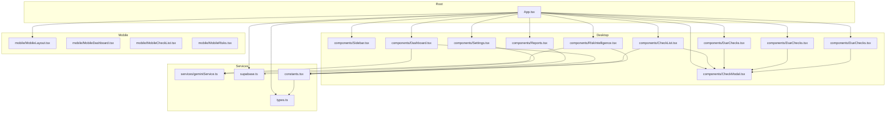
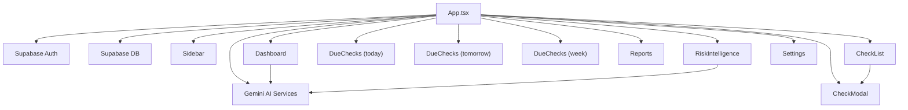
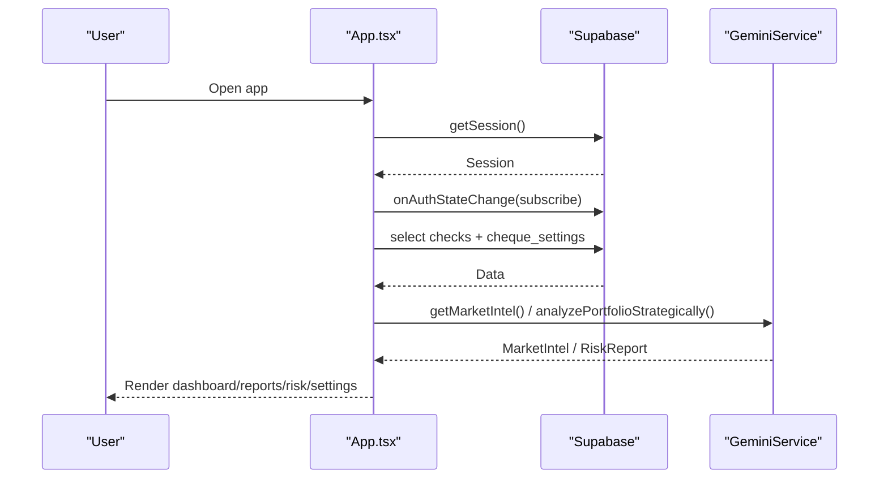
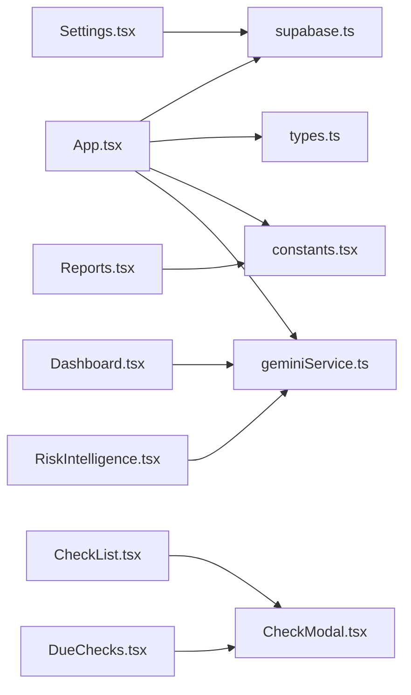

# Core Components

<cite>
**Referenced Files in This Document**
- [App.tsx](file://App.tsx)
- [types.ts](file://types.ts)
- [supabase.ts](file://supabase.ts)
- [constants.tsx](file://constants.tsx)
- [components/Sidebar.tsx](file://components/Sidebar.tsx)
- [components/Dashboard.tsx](file://components/Dashboard.tsx)
- [components/CheckList.tsx](file://components/CheckList.tsx)
- [components/CheckModal.tsx](file://components/CheckModal.tsx)
- [components/DueChecks.tsx](file://components/DueChecks.tsx)
- [components/Reports.tsx](file://components/Reports.tsx)
- [components/RiskIntelligence.tsx](file://components/RiskIntelligence.tsx)
- [components/Settings.tsx](file://components/Settings.tsx)
- [services/geminiService.ts](file://services/geminiService.ts)
- [mobile/MobileLayout.tsx](file://mobile/MobileLayout.tsx)
- [mobile/MobileDashboard.tsx](file://mobile/MobileDashboard.tsx)
- [mobile/MobileCheckList.tsx](file://mobile/MobileCheckList.tsx)
- [mobile/MobileRisks.tsx](file://mobile/MobileRisks.tsx)
</cite>

## Table of Contents
1. [Introduction](#introduction)
2. [Project Structure](#project-structure)
3. [Core Components](#core-components)
4. [Architecture Overview](#architecture-overview)
5. [Detailed Component Analysis](#detailed-component-analysis)
6. [Dependency Analysis](#dependency-analysis)
7. [Performance Considerations](#performance-considerations)
8. [Troubleshooting Guide](#troubleshooting-guide)
9. [Conclusion](#conclusion)

## Introduction
This document explains the core React components of GestionCh-ques, focusing on the main orchestrator App.tsx and the desktop component suite. It covers authentication and session management via Supabase, role-based access control, centralized state, and integration with AI services for market intelligence and risk analysis. It also documents the mobile layout and components, component composition patterns, reusability strategies, and best practices for extending functionality.

## Project Structure
The application follows a feature-based component organization with a dedicated services layer for AI integrations and a shared types/constants layer. Desktop and mobile share common domain logic while adapting UI for device constraints.

**Diagram sources**
- [App.tsx:32-403](file://App.tsx#L32-L403)
- [components/Sidebar.tsx:32-167](file://components/Sidebar.tsx#L32-L167)
- [components/Dashboard.tsx:27-205](file://components/Dashboard.tsx#L27-L205)
- [components/CheckList.tsx:21-349](file://components/CheckList.tsx#L21-L349)
- [components/DueChecks.tsx:22-157](file://components/DueChecks.tsx#L22-L157)
- [components/Reports.tsx:27-558](file://components/Reports.tsx#L27-L558)
- [components/RiskIntelligence.tsx:19-140](file://components/RiskIntelligence.tsx#L19-L140)
- [components/Settings.tsx:11-195](file://components/Settings.tsx#L11-L195)
- [components/CheckModal.tsx:27-310](file://components/CheckModal.tsx#L27-L310)
- [mobile/MobileLayout.tsx:28-161](file://mobile/MobileLayout.tsx#L28-L161)
- [mobile/MobileDashboard.tsx:21-258](file://mobile/MobileDashboard.tsx#L21-L258)
- [mobile/MobileCheckList.tsx:15-99](file://mobile/MobileCheckList.tsx#L15-L99)
- [mobile/MobileRisks.tsx:25-240](file://mobile/MobileRisks.tsx#L25-L240)
- [services/geminiService.ts:1-138](file://services/geminiService.ts#L1-L138)
- [supabase.ts:1-23](file://supabase.ts#L1-L23)
- [types.ts:1-77](file://types.ts#L1-L77)
- [constants.tsx:1-56](file://constants.tsx#L1-L56)

**Section sources**
- [App.tsx:32-403](file://App.tsx#L32-L403)
- [types.ts:1-77](file://types.ts#L1-L77)
- [supabase.ts:1-23](file://supabase.ts#L1-L23)
- [constants.tsx:1-56](file://constants.tsx#L1-L56)

## Core Components
This section focuses on the central orchestrator and the desktop components that form the primary user interface.

- App.tsx
  - Authentication and session lifecycle via Supabase.
  - Role-based access control (admin, restricted user, regular user).
  - Centralized state for checks, settings, notifications, UI state, and mobile detection.
  - Real-time synchronization with Supabase and visibility-based refresh.
  - Integration with AI services for market intelligence and risk analysis.
  - Desktop vs mobile rendering with shared props and callbacks.

- Sidebar
  - Navigation menu with role-aware visibility.
  - Collapsible layout with persistent user identity badge.

- Dashboard
  - Financial overview cards and recent checks.
  - Market intelligence integration with AI.
  - Period filtering and admin verification badge.

- CheckList
  - Comprehensive instrument registry with search, filters, pagination, and batch actions.
  - Inline edit and mark-as-paid actions.

- RiskIntelligence
  - Automated risk scoring and incident detection.
  - AI-driven deep portfolio analysis.

- Reports
  - Advanced analytics with charts and filters.
  - Export and print controls.

- Settings
  - System configuration persisted per user.
  - Notification preferences and branding.

- CheckModal
  - Instrument creation/editing with OCR-powered data extraction.

- DueChecks
  - Dedicated views for today/tomorrow/week due instruments.

**Section sources**
- [App.tsx:32-403](file://App.tsx#L32-L403)
- [components/Sidebar.tsx:32-167](file://components/Sidebar.tsx#L32-L167)
- [components/Dashboard.tsx:27-205](file://components/Dashboard.tsx#L27-L205)
- [components/CheckList.tsx:21-349](file://components/CheckList.tsx#L21-L349)
- [components/RiskIntelligence.tsx:19-140](file://components/RiskIntelligence.tsx#L19-L140)
- [components/Reports.tsx:27-558](file://components/Reports.tsx#L27-L558)
- [components/Settings.tsx:11-195](file://components/Settings.tsx#L11-L195)
- [components/CheckModal.tsx:27-310](file://components/CheckModal.tsx#L27-L310)
- [components/DueChecks.tsx:22-157](file://components/DueChecks.tsx#L22-L157)

## Architecture Overview
The desktop architecture centers around App.tsx as the single source of truth for state, routing, and integration. Components are composable and receive props for data and callbacks. Supabase provides authentication, real-time session updates, and persistence. AI services are encapsulated in a service module for market intelligence and risk analysis.

**Diagram sources**
- [App.tsx:111-178](file://App.tsx#L111-L178)
- [services/geminiService.ts:1-138](file://services/geminiService.ts#L1-L138)
- [supabase.ts:1-23](file://supabase.ts#L1-L23)

## Detailed Component Analysis

### App.tsx: Orchestrator, Authentication, and Routing
- Responsibilities
  - Manages session state and subscribes to auth state changes.
  - Implements role-based access control and tab restrictions.
  - Synchronizes data with Supabase (checks and settings).
  - Provides centralized callbacks for saving/deleting instruments and marking as paid.
  - Handles notifications, loading states, and responsive layout switching.
  - Integrates AI services for market intelligence and risk analysis.

- State and Props
  - Local state: session, activeTab, sidebar collapsed, checks, settings, notifications, modal open, editingCheck, loading, mobile flag.
  - Derived roles: isAdmin, isRestrictedUser, isManager.
  - Callbacks passed down to child components for data mutations and navigation.

- Integration Points
  - Supabase: auth session, real-time subscription, data reads/writes.
  - Gemini: market intelligence, risk analysis, OCR extraction.

- Event Handling and Data Flow
  - Auth events update session and trigger data sync.
  - Data sync fetches checks and settings, merges defaults, and updates state.
  - Child components call callbacks to mutate data; App persists to Supabase and refreshes.

**Diagram sources**
- [App.tsx:111-178](file://App.tsx#L111-L178)
- [services/geminiService.ts:101-138](file://services/geminiService.ts#L101-L138)
- [supabase.ts:1-23](file://supabase.ts#L1-L23)

**Section sources**
- [App.tsx:32-403](file://App.tsx#L32-L403)
- [supabase.ts:1-23](file://supabase.ts#L1-L23)
- [services/geminiService.ts:1-138](file://services/geminiService.ts#L1-L138)

### Sidebar: Navigation and Identity
- Responsibilities
  - Renders navigation items based on user role.
  - Collapsible layout with company identity and user badge.
  - Logout action.

- Props
  - activeTab, setActiveTab, companyName, logoUrl, onLogout, userEmail, isCollapsed, setIsCollapsed.

- Behavior
  - Filters menu items for restricted users.
  - Updates active state and renders identity badge.

**Section sources**
- [components/Sidebar.tsx:32-167](file://components/Sidebar.tsx#L32-L167)

### Dashboard: Financial Overview and Market Intelligence
- Responsibilities
  - Computes totals and balances for selected period.
  - Displays recent checks and market intelligence feed.
  - Admin verification badge.

- Props
  - checks, currency, onTabChange, isAdmin.

- Integration
  - Calls getMarketIntel from geminiService.
  - Uses constants for currency formatting and badges.

**Section sources**
- [components/Dashboard.tsx:27-205](file://components/Dashboard.tsx#L27-L205)
- [services/geminiService.ts:101-138](file://services/geminiService.ts#L101-L138)
- [constants.tsx:16-56](file://constants.tsx#L16-L56)

### CheckList: Instrument Registry and Batch Operations
- Responsibilities
  - Full-featured registry with search, filters, pagination.
  - Batch actions: mark as paid, delete.
  - Inline edit and add via modal.

- Props
  - checks, currency, onAdd, onEdit, onDelete, onMarkAsPaid, onBatchMarkAsPaid, onBatchDelete, isAdmin.

- State and UX
  - Selection state for batch operations.
  - Reset filters and pagination on filter changes.

**Section sources**
- [components/CheckList.tsx:21-349](file://components/CheckList.tsx#L21-L349)

### RiskIntelligence: AI-Powered Risk Assessment
- Responsibilities
  - Detects risks (returned, overdue, high-value).
  - Computes risk score and exposure.
  - Triggers deep portfolio analysis via AI.

- Props
  - checks, currency, highValueThreshold, onViewCheck.

- Integration
  - analyzePortfolioStrategically for strategic report.

**Section sources**
- [components/RiskIntelligence.tsx:19-140](file://components/RiskIntelligence.tsx#L19-L140)
- [services/geminiService.ts:63-96](file://services/geminiService.ts#L63-L96)

### Reports: Analytics and Charts
- Responsibilities
  - Advanced filtering by date range, type, status.
  - Summary cards, bar/pie charts, and paginated table.
  - Export/print/reset controls.

- Props
  - checks, currency.

- Data Processing
  - Uses memoization for derived stats and chart data.

**Section sources**
- [components/Reports.tsx:27-558](file://components/Reports.tsx#L27-L558)

### Settings: System Configuration
- Responsibilities
  - Per-user settings persisted to Supabase.
  - Logo upload, notification preferences, and timezone/date format.

- Props
  - settings, onSave.

- Persistence
  - Upserts settings with conflict handling.

**Section sources**
- [components/Settings.tsx:11-195](file://components/Settings.tsx#L11-L195)
- [supabase.ts:1-23](file://supabase.ts#L1-L23)

### CheckModal: Instrument Creation/Edit with OCR
- Responsibilities
  - Form for instrument fields.
  - Image upload with OCR extraction via AI.
  - Security indicators and encryption messaging.

- Props
  - onClose, onSave, initialData.

- Integration
  - extractCheckData for OCR.

**Section sources**
- [components/CheckModal.tsx:27-310](file://components/CheckModal.tsx#L27-L310)
- [services/geminiService.ts:9-58](file://services/geminiService.ts#L9-L58)

### DueChecks: Due Today/Tomorrow/Week Views
- Responsibilities
  - Filter checks by due date windows.
  - Provide quick actions to mark as paid and edit.

- Props
  - checks, mode, currency, onEdit, onMarkAsPaid, isAdmin.

**Section sources**
- [components/DueChecks.tsx:22-157](file://components/DueChecks.tsx#L22-L157)

### Mobile Architecture
- MobileLayout
  - Bottom navigation with integrated add button.
  - Renders MobileDashboard, MobileCheckList, MobileRisks.
  - Opens CheckModal for add/edit.

- MobileDashboard
  - Compact summary cards and filtered lists.
  - Pagination and quick actions.

- MobileCheckList
  - Swipeable rows with floating action overlays.

- MobileRisks
  - Risk score, vulnerability signals, and AI insights.

**Section sources**
- [mobile/MobileLayout.tsx:28-161](file://mobile/MobileLayout.tsx#L28-L161)
- [mobile/MobileDashboard.tsx:21-258](file://mobile/MobileDashboard.tsx#L21-L258)
- [mobile/MobileCheckList.tsx:15-99](file://mobile/MobileCheckList.tsx#L15-L99)
- [mobile/MobileRisks.tsx:25-240](file://mobile/MobileRisks.tsx#L25-L240)

## Dependency Analysis
- Component Coupling
  - App.tsx is the central hub; most components depend on it for data and callbacks.
  - Shared types and constants reduce coupling across modules.

- External Dependencies
  - Supabase for auth and persistence.
  - Gemini for AI features.

- Circular Dependencies
  - None observed among core components.

**Diagram sources**
- [App.tsx:111-178](file://App.tsx#L111-L178)
- [components/Dashboard.tsx:18-205](file://components/Dashboard.tsx#L18-L205)
- [components/RiskIntelligence.tsx:10-140](file://components/RiskIntelligence.tsx#L10-L140)
- [components/CheckList.tsx:27-349](file://components/CheckList.tsx#L27-L349)
- [components/DueChecks.tsx:22-157](file://components/DueChecks.tsx#L22-L157)
- [components/Reports.tsx:17-558](file://components/Reports.tsx#L17-L558)
- [components/Settings.tsx:11-195](file://components/Settings.tsx#L11-L195)
- [services/geminiService.ts:1-138](file://services/geminiService.ts#L1-L138)
- [supabase.ts:1-23](file://supabase.ts#L1-L23)
- [types.ts:1-77](file://types.ts#L1-L77)
- [constants.tsx:1-56](file://constants.tsx#L1-L56)

**Section sources**
- [App.tsx:111-178](file://App.tsx#L111-L178)
- [types.ts:1-77](file://types.ts#L1-L77)
- [constants.tsx:1-56](file://constants.tsx#L1-L56)
- [supabase.ts:1-23](file://supabase.ts#L1-L23)
- [services/geminiService.ts:1-138](file://services/geminiService.ts#L1-L138)

## Performance Considerations
- Memoization
  - Use useMemo for derived computations (dashboard stats, risk analysis, chart data) to avoid unnecessary recalculations.
- Pagination
  - Prefer server-side pagination for very large datasets; client-side pagination is acceptable for moderate sizes.
- Debounced Inputs
  - Debounce search inputs to limit frequent re-renders.
- Conditional Rendering
  - Lazy-load heavy components (e.g., reports) only when needed.
- AI Calls
  - Cache AI responses where appropriate and guard against quota limits.
- Supabase Queries
  - Use targeted queries and indexes; avoid SELECT * where possible.

## Troubleshooting Guide
- Authentication Issues
  - Verify Supabase credentials and network connectivity.
  - Check auth state subscription and session persistence.

- Data Sync Problems
  - Confirm user role affects query scope (manager vs non-manager).
  - Inspect error handling for settings retrieval (PGRST116).

- AI Feature Failures
  - Ensure API key is configured; handle quota exceeded scenarios gracefully.
  - Validate image uploads and OCR expectations.

- Mobile Responsiveness
  - Test bottom navigation and modal overlays across screen sizes.
  - Ensure keyboard and overlay interactions work as expected.

**Section sources**
- [App.tsx:146-164](file://App.tsx#L146-L164)
- [services/geminiService.ts:51-58](file://services/geminiService.ts#L51-L58)
- [services/geminiService.ts:91-95](file://services/geminiService.ts#L91-L95)
- [services/geminiService.ts:129-136](file://services/geminiService.ts#L129-L136)

## Conclusion
GestionCh-ques demonstrates a clean separation of concerns with App.tsx orchestrating state, routing, and integrations. The desktop components are highly reusable and composable, leveraging shared types, constants, and services. Role-based access control and Supabase integration provide secure, real-time data synchronization. AI services enhance financial intelligence and risk assessment. The mobile layout mirrors core functionality with device-specific UX patterns. Extending the system involves adding new tabs, integrating additional AI features, and enhancing filters or analytics while preserving existing patterns.