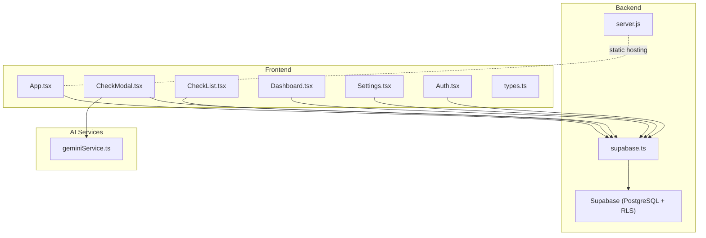
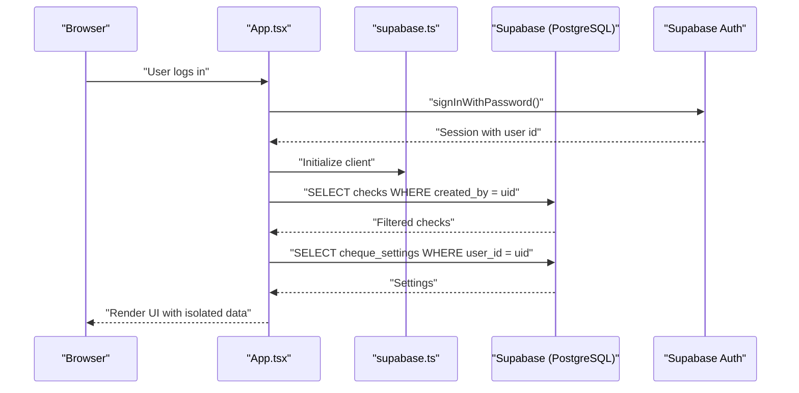
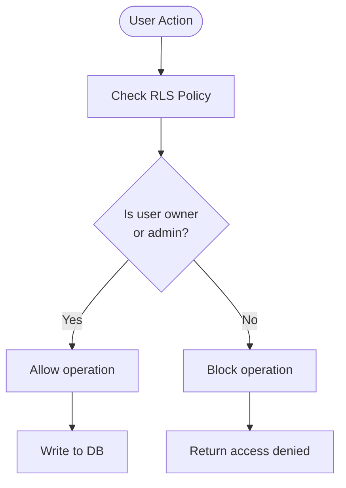
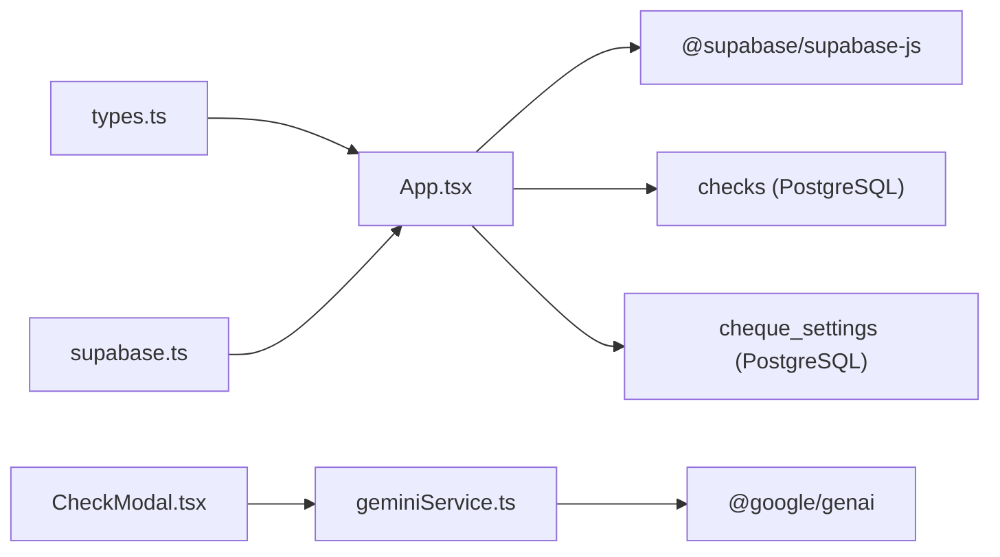

# Database Design and Management

<cite>
**Referenced Files in This Document**
- [setup.sql](file://setup.sql)
- [types.ts](file://types.ts)
- [supabase.ts](file://supabase.ts)
- [App.tsx](file://App.tsx)
- [components/CheckList.tsx](file://components/CheckList.tsx)
- [components/CheckModal.tsx](file://components/CheckModal.tsx)
- [components/Dashboard.tsx](file://components/Dashboard.tsx)
- [components/Settings.tsx](file://components/Settings.tsx)
- [components/Auth.tsx](file://components/Auth.tsx)
- [services/geminiService.ts](file://services/geminiService.ts)
- [package.json](file://package.json)
- [server.js](file://server.js)
</cite>

## Table of Contents
1. [Introduction](#introduction)
2. [Project Structure](#project-structure)
3. [Core Components](#core-components)
4. [Architecture Overview](#architecture-overview)
5. [Detailed Component Analysis](#detailed-component-analysis)
6. [Dependency Analysis](#dependency-analysis)
7. [Performance Considerations](#performance-considerations)
8. [Troubleshooting Guide](#troubleshooting-guide)
9. [Conclusion](#conclusion)
10. [Appendices](#appendices)

## Introduction
This document provides comprehensive data model documentation for the GestionCh-ques financial instrument management system. It covers the relational schema for checks and system settings, the TypeScript interfaces used across the application, row-level security (RLS) policies, access control mechanisms, validation rules, lifecycle management, and practical query patterns. It also outlines migration strategies, performance considerations, and operational troubleshooting steps grounded in the repository’s SQL and TypeScript code.

## Project Structure
The application is a React SPA with a Node.js static server and a Supabase backend. The database schema is defined in a single initialization script and consumed by the frontend via Supabase client APIs. Authentication is handled by Supabase Auth, and optional AI-powered OCR and analytics leverage the Gemini SDK.



**Diagram sources**
- [App.tsx:1-406](file://App.tsx#L1-L406)
- [components/CheckList.tsx:1-350](file://components/CheckList.tsx#L1-L350)
- [components/CheckModal.tsx:1-311](file://components/CheckModal.tsx#L1-L311)
- [components/Dashboard.tsx:1-206](file://components/Dashboard.tsx#L1-L206)
- [components/Settings.tsx:1-196](file://components/Settings.tsx#L1-L196)
- [components/Auth.tsx:1-112](file://components/Auth.tsx#L1-L112)
- [types.ts:1-77](file://types.ts#L1-L77)
- [supabase.ts:1-23](file://supabase.ts#L1-L23)
- [server.js:1-101](file://server.js#L1-L101)
- [services/geminiService.ts:1-138](file://services/geminiService.ts#L1-L138)

**Section sources**
- [setup.sql:1-61](file://setup.sql#L1-L61)
- [types.ts:1-77](file://types.ts#L1-L77)
- [supabase.ts:1-23](file://supabase.ts#L1-L23)
- [server.js:1-101](file://server.js#L1-L101)

## Core Components
This section documents the two primary relational tables and their associated TypeScript interfaces.

### Checks Table
- Purpose: Stores financial instruments (checks) with full lifecycle tracking.
- Ownership: Each record is owned by a user via a foreign key relationship.
- RLS: Enabled and enforced per user and admin privileges.

Primary key
- id (UUID)

Foreign keys
- created_by → auth.users(id) with cascade delete

Indexes and constraints
- Unique and non-unique indexes are not explicitly declared in the initialization script; however, typical performance tuning would consider adding indexes on frequently queried columns such as created_by, due_date, status, and type.

Constraints and defaults
- amount numeric with precision and scale suitable for financial data
- type constrained to incoming or outgoing
- status constrained to pending, paid, returned, garantie with default pending
- timestamps default to current time

Columns
- id, check_number, bank_name, amount, issue_date, due_date, entity_name, type, status, image_url, created_at, notes, fund_name, amount_in_words, created_by

**Section sources**
- [setup.sql:3-19](file://setup.sql#L3-L19)
- [types.ts:45-60](file://types.ts#L45-L60)

### System Settings Table (cheque_settings)
- Purpose: Per-user system preferences and alert configurations.
- Ownership: One record per user identified by user_id.

Primary key
- user_id (UUID)

Foreign keys
- user_id → auth.users(id) with cascade delete

Constraints and defaults
- Company name, currency, timezone, date format, fiscal year start, alert toggles, alert method, alert days, and logo URL with sensible defaults.

Columns
- user_id, company_name, currency, timezone, date_format, fiscal_start, alert_before, alert_delay, alert_method, alert_days, logo_url, updated_at

**Section sources**
- [setup.sql:22-35](file://setup.sql#L22-L35)
- [types.ts:62-74](file://types.ts#L62-L74)

### TypeScript Interfaces and Enums
- CheckType: incoming, outgoing
- CheckStatus: pending, paid, returned, garantie
- Currency: EUR, MAD, USD
- RiskLevel: high, medium, low
- FinancialRisk: risk model for reporting
- AppNotification: notification model
- Check: shape of a check record
- SystemSettings: shape of user settings
- AppTab: navigation tab identifiers

These interfaces align with the database schema and are used across UI components for type safety.

**Section sources**
- [types.ts:2-12](file://types.ts#L2-L12)
- [types.ts:14-24](file://types.ts#L14-L24)
- [types.ts:26-43](file://types.ts#L26-L43)
- [types.ts:45-74](file://types.ts#L45-L74)
- [types.ts:76-77](file://types.ts#L76-L77)

## Architecture Overview
The system uses Supabase as the backend, enabling PostgreSQL storage, Supabase Auth for identity, and Row Level Security for data isolation. The frontend authenticates via Supabase, then performs CRUD operations scoped to the authenticated user’s data, except for designated administrators who can access broader datasets.



**Diagram sources**
- [components/Auth.tsx:12-27](file://components/Auth.tsx#L12-L27)
- [App.tsx:111-164](file://App.tsx#L111-L164)
- [supabase.ts:12-22](file://supabase.ts#L12-L22)

## Detailed Component Analysis

### Access Control and Row-Level Security
- RLS enabled on both checks and cheque_settings.
- Policy for checks allows:
  - Owners (based on created_by)
  - Administrators (specific emails)
- Policy for settings allows:
  - Owner (based on user_id)
  - Administrators (specific emails)

Frontend enforcement
- Non-admin users are filtered by created_by when fetching checks.
- Settings are fetched by user_id.



**Diagram sources**
- [setup.sql:46-51](file://setup.sql#L46-L51)
- [setup.sql:56-60](file://setup.sql#L56-L60)
- [App.tsx:126-141](file://App.tsx#L126-L141)

**Section sources**
- [setup.sql:37-61](file://setup.sql#L37-L61)
- [App.tsx:126-141](file://App.tsx#L126-L141)

### Data Validation Rules and Business Constraints
- Enumerated statuses and types enforced by database CHECK constraints.
- Amount stored as numeric with two decimals for financial accuracy.
- Dates enforced as DATE; due_date and issue_date are required.
- Entity ownership enforced by created_by foreign key.
- Settings defaults ensure consistent baseline configuration.

**Section sources**
- [setup.sql:11-12](file://setup.sql#L11-L12)
- [setup.sql:7](file://setup.sql#L7)
- [setup.sql:8-9](file://setup.sql#L8-L9)
- [setup.sql:18](file://setup.sql#L18)
- [setup.sql:24-34](file://setup.sql#L24-L34)

### Data Lifecycle Management
- Creation: created_at defaults to current timestamp; created_by populated on insert for new checks.
- Updates: updated_at defaults to current timestamp; upsert used for settings.
- Deletion: cascade delete on user deletion ensures referential integrity.
- Status transitions: UI supports marking as paid; batch operations supported.

**Section sources**
- [setup.sql:14](file://setup.sql#L14)
- [setup.sql:34](file://setup.sql#L34)
- [setup.sql:18](file://setup.sql#L18)
- [App.tsx:194-237](file://App.tsx#L194-L237)

### Sample Data Structures
Representative rows conforming to the schema:

Checks
- id: UUID
- check_number: text
- bank_name: text
- amount: numeric
- issue_date: date
- due_date: date
- entity_name: text
- type: enum incoming/outgoing
- status: enum pending/paid/returned/garantie
- image_url: text
- created_at: timestamptz
- notes: text
- fund_name: text
- amount_in_words: text
- created_by: UUID

System Settings
- user_id: UUID
- company_name: text
- currency: text
- timezone: text
- date_format: text
- fiscal_start: date
- alert_before: boolean
- alert_delay: boolean
- alert_method: text
- alert_days: integer
- logo_url: text
- updated_at: timestamptz

**Section sources**
- [setup.sql:3-19](file://setup.sql#L3-L19)
- [setup.sql:22-35](file://setup.sql#L22-L35)
- [types.ts:45-60](file://types.ts#L45-L60)
- [types.ts:62-74](file://types.ts#L62-L74)

### Common Query Patterns Used by the Application
- Fetch checks with optional manager override:
  - SELECT * FROM checks ORDER BY created_at DESC
  - Filter by created_by for non-managers
- Upsert settings:
  - INSERT INTO cheque_settings (...) ON CONFLICT (user_id) DO UPDATE SET ...
- Update status:
  - UPDATE checks SET status = ? WHERE id = ?
- Delete records:
  - DELETE FROM checks WHERE id = ?

These patterns are executed via Supabase client APIs in the frontend.

**Section sources**
- [App.tsx:126-141](file://App.tsx#L126-L141)
- [App.tsx:180-192](file://App.tsx#L180-L192)
- [App.tsx:194-237](file://App.tsx#L194-L237)

## Dependency Analysis
- Supabase client initialized with project URL and anonymous key.
- Frontend components depend on Supabase client for all DB operations.
- Optional AI features depend on Gemini SDK and environment configuration.



**Diagram sources**
- [types.ts:1-77](file://types.ts#L1-L77)
- [supabase.ts:1-23](file://supabase.ts#L1-L23)
- [App.tsx:13-14](file://App.tsx#L13-L14)
- [components/CheckModal.tsx:5](file://components/CheckModal.tsx#L5)
- [services/geminiService.ts:1-4](file://services/geminiService.ts#L1-L4)
- [package.json:13-24](file://package.json#L13-L24)

**Section sources**
- [package.json:13-24](file://package.json#L13-L24)
- [supabase.ts:1-23](file://supabase.ts#L1-L23)
- [App.tsx:13-14](file://App.tsx#L13-L14)

## Performance Considerations
- Indexing strategy
  - Add indexes on checks(created_by), checks(due_date), checks(status), checks(type) to optimize filtering and sorting.
  - Consider partial indexes for active/incoming/outgoing filters.
- Pagination
  - Use LIMIT and OFFSET or cursor-based pagination for large datasets.
- RLS overhead
  - Keep policies minimal and avoid heavy expressions; ensure proper indexing to mitigate RLS evaluation cost.
- Network efficiency
  - Batch updates (batch mark as paid/delete) reduce round-trips.
- Client caching
  - Cache settings and recent checks in memory to minimize redundant queries.

[No sources needed since this section provides general guidance]

## Troubleshooting Guide
- Authentication failures
  - Verify Supabase project URL and anonymous key; ensure environment variables are loaded.
- Access denied errors
  - Confirm user is either owner (created_by) or administrator (specific emails).
  - Check RLS policies and JWT claims.
- Settings not loading
  - Ensure user_id matches the authenticated user; handle maybeSingle() gracefully.
- API quota exceeded (Gemini)
  - Monitor quota errors and retry after cooldown; configure API key properly.
- CORS and static serving
  - Review server middleware for CORS and static file serving.

**Section sources**
- [supabase.ts:5-6](file://supabase.ts#L5-L6)
- [App.tsx:146-158](file://App.tsx#L146-L158)
- [setup.sql:46-60](file://setup.sql#L46-L60)
- [services/geminiService.ts:53-56](file://services/geminiService.ts#L53-L56)
- [server.js:26-35](file://server.js#L26-L35)

## Conclusion
The GestionCh-ques system employs a clean relational design with strong access control via Supabase RLS and TypeScript interfaces ensuring type-safe interactions. The schema supports robust financial instrument lifecycle management, while the frontend enforces user isolation and admin capabilities. By implementing recommended indexing and batching strategies, the system can achieve scalable performance and maintainable operations.

[No sources needed since this section summarizes without analyzing specific files]

## Appendices

### Schema Evolution and Migration Strategies
- Version control SQL migrations
  - Maintain a migration directory with numbered scripts; apply incrementally.
- Backward compatibility
  - Use nullable columns and defaults for new fields; avoid dropping columns unless necessary.
- RLS and constraints
  - Introduce new policies and constraints with careful testing; document breaking changes.
- Rollback procedures
  - Keep reversible changes; snapshot data before destructive migrations.

[No sources needed since this section provides general guidance]

### Data Model Diagram
```mermaid
erDiagram
CHECKS {
uuid id PK
text check_number
text bank_name
numeric amount
date issue_date
date due_date
text entity_name
text type
text status
text image_url
timestamptz created_at
text notes
text fund_name
text amount_in_words
uuid created_by FK
}
CHEQUE_SETTINGS {
uuid user_id PK FK
text company_name
text currency
text timezone
text date_format
date fiscal_start
boolean alert_before
boolean alert_delay
text alert_method
int alert_days
text logo_url
timestamptz updated_at
}
AUTH_USERS {
uuid id PK
}
AUTH_USERS ||--o{ CHECKS : "owns"
AUTH_USERS ||--o{ CHEQUE_SETTINGS : "owns"
```

**Diagram sources**
- [setup.sql:3-19](file://setup.sql#L3-L19)
- [setup.sql:22-35](file://setup.sql#L22-L35)