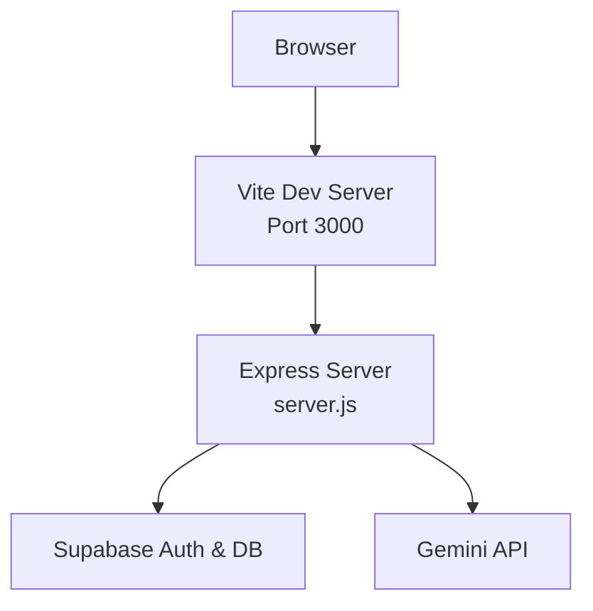
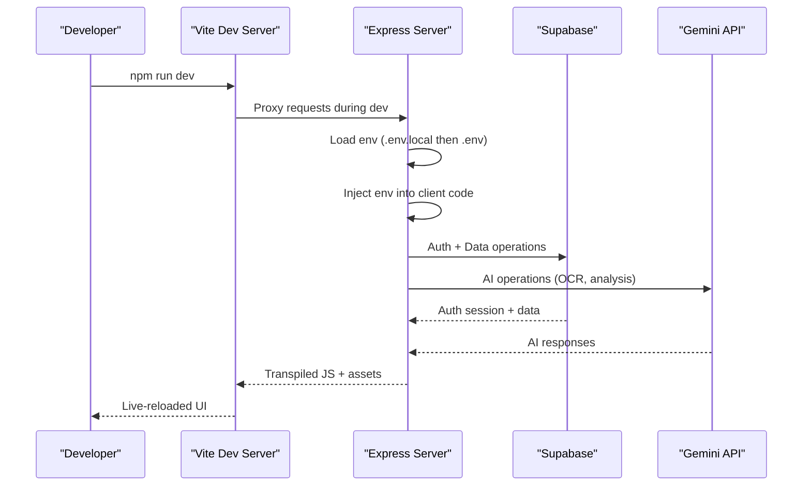
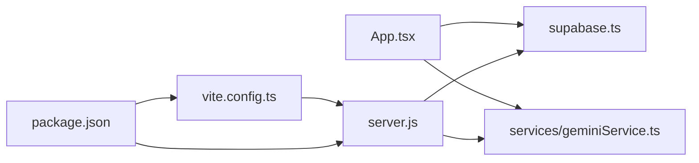

# Getting Started

<cite>
**Referenced Files in This Document**
- [README.md](file://README.md)
- [package.json](file://package.json)
- [vite.config.ts](file://vite.config.ts)
- [server.js](file://server.js)
- [App.tsx](file://App.tsx)
- [supabase.ts](file://supabase.ts)
- [services/geminiService.ts](file://services/geminiService.ts)
- [setup.sql](file://setup.sql)
- [types.ts](file://types.ts)
- [index.tsx](file://index.tsx)
</cite>

## Table of Contents
1. [Introduction](#introduction)
2. [Project Structure](#project-structure)
3. [Core Components](#core-components)
4. [Architecture Overview](#architecture-overview)
5. [Detailed Component Analysis](#detailed-component-analysis)
6. [Dependency Analysis](#dependency-analysis)
7. [Performance Considerations](#performance-considerations)
8. [Troubleshooting Guide](#troubleshooting-guide)
9. [Conclusion](#conclusion)
10. [Appendices](#appendices)

## Introduction
This guide helps you install, configure, and run GestionCh-ques locally. It covers prerequisites, environment setup, development server startup, initial verification, and basic usage. The application integrates AI-powered financial insights via the Gemini API and user authentication via Supabase.

## Project Structure
At a high level, the project consists of:
- A React frontend built with Vite
- A lightweight Express server that serves static assets and transpiles TypeScript/JSX on demand
- Supabase for authentication and data persistence
- Gemini AI services for OCR and analytics

**Diagram sources**
- [vite.config.ts:1-24](file://vite.config.ts#L1-L24)
- [server.js:14-101](file://server.js#L14-L101)
- [supabase.ts:1-23](file://supabase.ts#L1-L23)
- [services/geminiService.ts:1-138](file://services/geminiService.ts#L1-L138)

**Section sources**
- [README.md:11-21](file://README.md#L11-L21)
- [package.json:6-12](file://package.json#L6-L12)
- [vite.config.ts:5-23](file://vite.config.ts#L5-L23)
- [server.js:14-101](file://server.js#L14-L101)

## Core Components
- Frontend runtime and build tooling:
  - Vite dev server with React plugin and TypeScript/JSX support
  - Root entry renders the App component
- Backend runtime:
  - Express server serving static files and transpiling TS/TSX on demand
  - Environment injection for API keys and Supabase credentials
- Authentication and storage:
  - Supabase client initialized with a predefined project URL and anonymous key
- AI services:
  - Gemini client configured to use either API_KEY or GEMINI_API_KEY

**Section sources**
- [vite.config.ts:1-24](file://vite.config.ts#L1-L24)
- [index.tsx:1-17](file://index.tsx#L1-L17)
- [App.tsx:1-406](file://App.tsx#L1-L406)
- [server.js:6-12](file://server.js#L6-L12)
- [supabase.ts:1-23](file://supabase.ts#L1-L23)
- [services/geminiService.ts:1-5](file://services/geminiService.ts#L1-L5)

## Architecture Overview
The development stack combines a Vite-managed React app with an Express server that:
- Serves static assets
- Transpiles TypeScript/JSX on-demand with caching
- Injects environment variables into client bundles
- Routes SPA fallback to index.html
- Integrates with Supabase for auth and data
- Integrates with Gemini for AI features

**Diagram sources**
- [package.json:6-8](file://package.json#L6-L8)
- [vite.config.ts:5-23](file://vite.config.ts#L5-L23)
- [server.js:6-12](file://server.js#L6-L12)
- [server.js:37-85](file://server.js#L37-L85)
- [supabase.ts:12-22](file://supabase.ts#L12-L22)
- [services/geminiService.ts:1-5](file://services/geminiService.ts#L1-L5)

## Detailed Component Analysis

### Prerequisites
- Node.js version requirement:
  - The project requires Node.js 18 or newer.
- System dependencies:
  - No OS-specific native dependencies are declared in the project’s package manifest.
  - Ensure your system has a modern browser for local development.

**Section sources**
- [package.json:10-12](file://package.json#L10-L12)

### Step-by-Step Installation
1. Install dependencies
   - Run the standard dependency installer to fetch all required packages.
   - Reference: [package.json:13-28](file://package.json#L13-L28)
2. Configure environment variables
   - Create a local environment file named .env.local and set the Gemini API key.
   - Reference: [README.md:18](file://README.md#L18)
3. Start the development server
   - Launch the Vite dev server to run the app locally.
   - Reference: [README.md:20](file://README.md#L20), [package.json:8](file://package.json#L8)

Notes:
- The Express server is primarily used for transpilation and SPA routing during development. The Vite dev server proxies requests and simplifies the local workflow.

**Section sources**
- [README.md:16-20](file://README.md#L16-L20)
- [package.json:6-8](file://package.json#L6-L8)

### Environment Configuration
Critical configuration for local operation:
- Gemini API key
  - Set the key in .env.local under the GEMINI_API_KEY variable.
  - The system also recognizes API_KEY as a fallback.
  - References:
    - [README.md:18](file://README.md#L18)
    - [server.js:6-12](file://server.js#L6-L12)
    - [vite.config.ts:14-15](file://vite.config.ts#L14-L15)
    - [services/geminiService.ts:3](file://services/geminiService.ts#L3)
- Supabase credentials
  - Supabase is preconfigured with a project URL and anonymous key.
  - References:
    - [supabase.ts:5-6](file://supabase.ts#L5-L6)
    - [server.js:62-67](file://server.js#L62-L67)

Verification:
- Confirm the environment variables are loaded by checking logs during startup and inspecting the injected values in the browser console.

**Section sources**
- [README.md:18](file://README.md#L18)
- [server.js:6-12](file://server.js#L6-L12)
- [vite.config.ts:14-15](file://vite.config.ts#L14-L15)
- [services/geminiService.ts:3](file://services/geminiService.ts#L3)
- [supabase.ts:5-6](file://supabase.ts#L5-L6)

### Development Server Setup
- Vite dev server
  - Starts on port 3000 by default and binds to 0.0.0.0 for external access.
  - References:
    - [vite.config.ts:8-11](file://vite.config.ts#L8-L11)
    - [package.json:8](file://package.json#L8)
- Express server behavior
  - Loads .env.local first, then falls back to .env.
  - Injects environment variables into client code at transpile time.
  - References:
    - [server.js:6-7](file://server.js#L6-L7)
    - [server.js:62-67](file://server.js#L62-L67)

**Section sources**
- [vite.config.ts:8-11](file://vite.config.ts#L8-L11)
- [server.js:6-12](file://server.js#L6-L12)
- [server.js:62-67](file://server.js#L62-L67)

### Initial Setup Verification
After starting the app:
- Open the browser at http://localhost:3000
- Verify:
  - The app loads without errors
  - Supabase authentication initializes (you will be prompted to sign in)
  - If the Gemini API key is configured, AI features (OCR, portfolio analysis, market intelligence) become available

References:
- [App.tsx:112-120](file://App.tsx#L112-L120)
- [supabase.ts:12-22](file://supabase.ts#L12-L22)
- [services/geminiService.ts:10-13](file://services/geminiService.ts#L10-L13)

**Section sources**
- [App.tsx:112-120](file://App.tsx#L112-L120)
- [supabase.ts:12-22](file://supabase.ts#L12-L22)
- [services/geminiService.ts:10-13](file://services/geminiService.ts#L10-L13)

### Basic Usage Examples
- Sign in with Supabase
  - The app uses Supabase for authentication. After signing in, your session is synchronized with the backend.
  - References:
    - [App.tsx:112-120](file://App.tsx#L112-L120)
    - [supabase.ts:12-22](file://supabase.ts#L12-L22)
- Manage checks
  - Add, edit, mark as paid, or delete checks. Data is persisted in Supabase tables.
  - References:
    - [App.tsx:194-228](file://App.tsx#L194-L228)
    - [setup.sql:3-19](file://setup.sql#L3-L19)
- Use AI features
  - With a valid Gemini API key, use OCR to extract check details and get strategic insights.
  - References:
    - [services/geminiService.ts:9-58](file://services/geminiService.ts#L9-L58)
    - [services/geminiService.ts:63-96](file://services/geminiService.ts#L63-L96)

**Section sources**
- [App.tsx:112-120](file://App.tsx#L112-L120)
- [supabase.ts:12-22](file://supabase.ts#L12-L22)
- [App.tsx:194-228](file://App.tsx#L194-L228)
- [setup.sql:3-19](file://setup.sql#L3-L19)
- [services/geminiService.ts:9-58](file://services/geminiService.ts#L9-L58)
- [services/geminiService.ts:63-96](file://services/geminiService.ts#L63-L96)

## Dependency Analysis
- Runtime dependencies
  - @google/genai: Gemini AI integration
  - @supabase/supabase-js: Supabase client
  - dotenv: Environment loading
  - express: Lightweight server for transpilation and SPA routing
  - lucide-react, recharts: UI and charts
  - react, react-dom: UI framework
  - sucrase: On-the-fly TypeScript/JSX transpilation
- Build-time dependencies
  - @vitejs/plugin-react and vite for development

**Diagram sources**
- [App.tsx:14](file://App.tsx#L14)
- [supabase.ts:2](file://supabase.ts#L2)
- [services/geminiService.ts:1](file://services/geminiService.ts#L1)
- [vite.config.ts:1-3](file://vite.config.ts#L1-L3)
- [server.js:2-5](file://server.js#L2-L5)
- [package.json:13-28](file://package.json#L13-L28)

**Section sources**
- [package.json:13-28](file://package.json#L13-L28)
- [vite.config.ts:1-3](file://vite.config.ts#L1-L3)
- [server.js:2-5](file://server.js#L2-L5)
- [App.tsx:14](file://App.tsx#L14)
- [supabase.ts:2](file://supabase.ts#L2)
- [services/geminiService.ts:1](file://services/geminiService.ts#L1)

## Performance Considerations
- Transpilation caching
  - The Express server caches transpiled TypeScript/JSX to improve performance during development.
  - Reference: [server.js:18](file://server.js#L18), [server.js:44](file://server.js#L44)
- SPA routing
  - The server routes unmatched routes to index.html to support client-side navigation.
  - Reference: [server.js:91-96](file://server.js#L91-L96)

**Section sources**
- [server.js:18-19](file://server.js#L18-L19)
- [server.js:44](file://server.js#L44)
- [server.js:91-96](file://server.js#L91-L96)

## Troubleshooting Guide
Common setup issues and resolutions:

- Node.js version mismatch
  - Symptom: Installation fails or scripts do not run.
  - Resolution: Ensure Node.js 18+ is installed.
  - Reference: [package.json:10-12](file://package.json#L10-L12)

- Missing Gemini API key
  - Symptom: AI features show warnings or disabled messages.
  - Resolution: Set GEMINI_API_KEY in .env.local. The system also accepts API_KEY as a fallback.
  - References:
    - [README.md:18](file://README.md#L18)
    - [server.js:6-12](file://server.js#L6-L12)
    - [services/geminiService.ts:3](file://services/geminiService.ts#L3)

- Supabase connectivity issues
  - Symptom: Authentication or data operations fail.
  - Resolution: Verify Supabase project URL and anonymous key are correct; ensure network access to Supabase.
  - References:
    - [supabase.ts:5-6](file://supabase.ts#L5-L6)
    - [server.js:62-67](file://server.js#L62-L67)

- Port conflicts
  - Symptom: Vite or Express cannot bind to port 3000.
  - Resolution: Change the port in the Vite configuration or free the port.
  - References:
    - [vite.config.ts:8-11](file://vite.config.ts#L8-L11)
    - [server.js:15](file://server.js#L15)

- Environment not loading
  - Symptom: Variables appear undefined in the client.
  - Resolution: Confirm .env.local exists and contains the required keys; note that the server injects variables into client code at transpile time.
  - References:
    - [server.js:6-7](file://server.js#L6-L7)
    - [server.js:62-67](file://server.js#L62-L67)

**Section sources**
- [package.json:10-12](file://package.json#L10-L12)
- [README.md:18](file://README.md#L18)
- [server.js:6-12](file://server.js#L6-L12)
- [services/geminiService.ts:3](file://services/geminiService.ts#L3)
- [supabase.ts:5-6](file://supabase.ts#L5-L6)
- [server.js:62-67](file://server.js#L62-L67)
- [vite.config.ts:8-11](file://vite.config.ts#L8-L11)
- [server.js:15](file://server.js#L15)

## Conclusion
You now have the essentials to install, configure, and run GestionCh-ques locally. Ensure Node.js 18+, set your Gemini API key in .env.local, and launch the app with the Vite dev server. Once authenticated via Supabase, you can manage checks and leverage AI features powered by Gemini.

## Appendices

### Database Schema Notes
- The project expects two tables: checks and cheque_settings.
- Row Level Security policies restrict access based on user identity and roles.
- References:
  - [setup.sql:3-19](file://setup.sql#L3-L19)
  - [setup.sql:21-35](file://setup.sql#L21-L35)
  - [setup.sql:37-61](file://setup.sql#L37-L61)

**Section sources**
- [setup.sql:3-19](file://setup.sql#L3-L19)
- [setup.sql:21-35](file://setup.sql#L21-L35)
- [setup.sql:37-61](file://setup.sql#L37-L61)