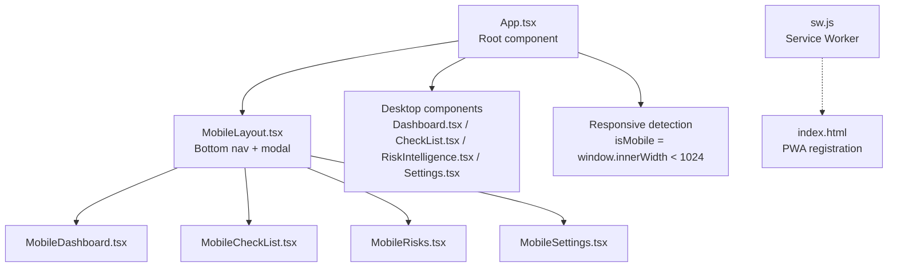
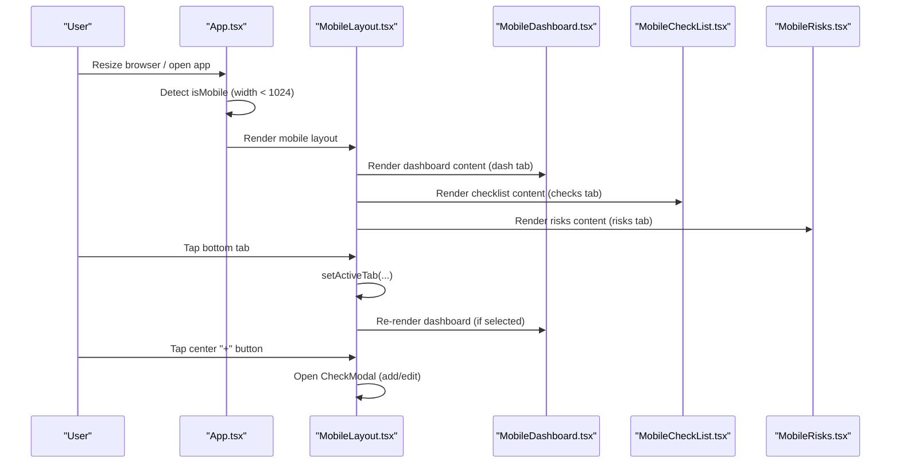
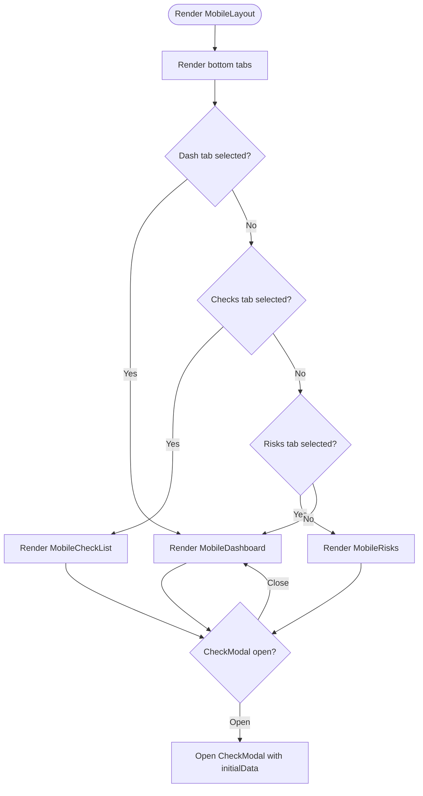
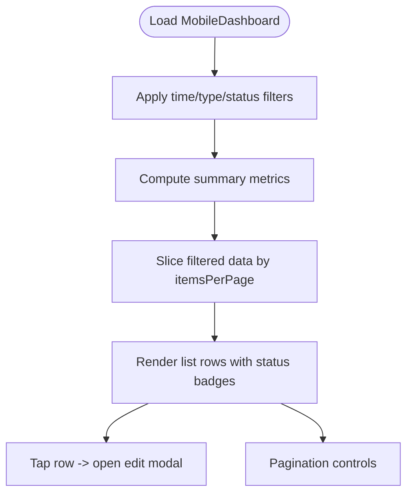
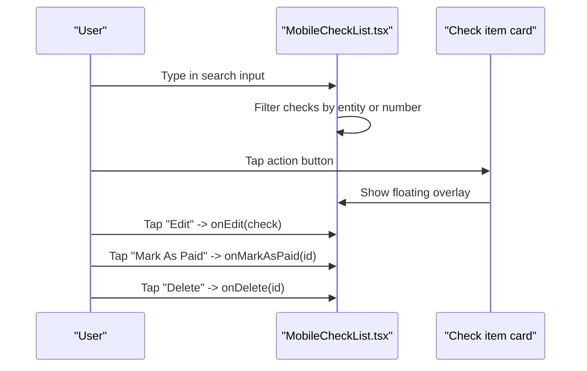
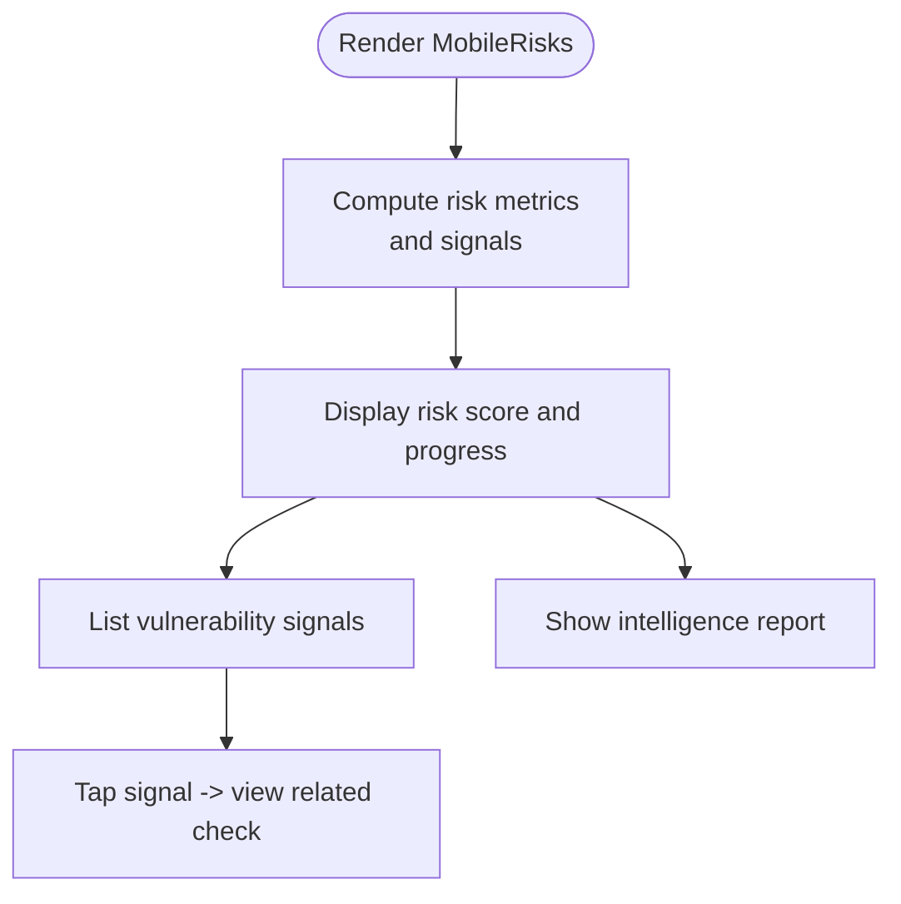
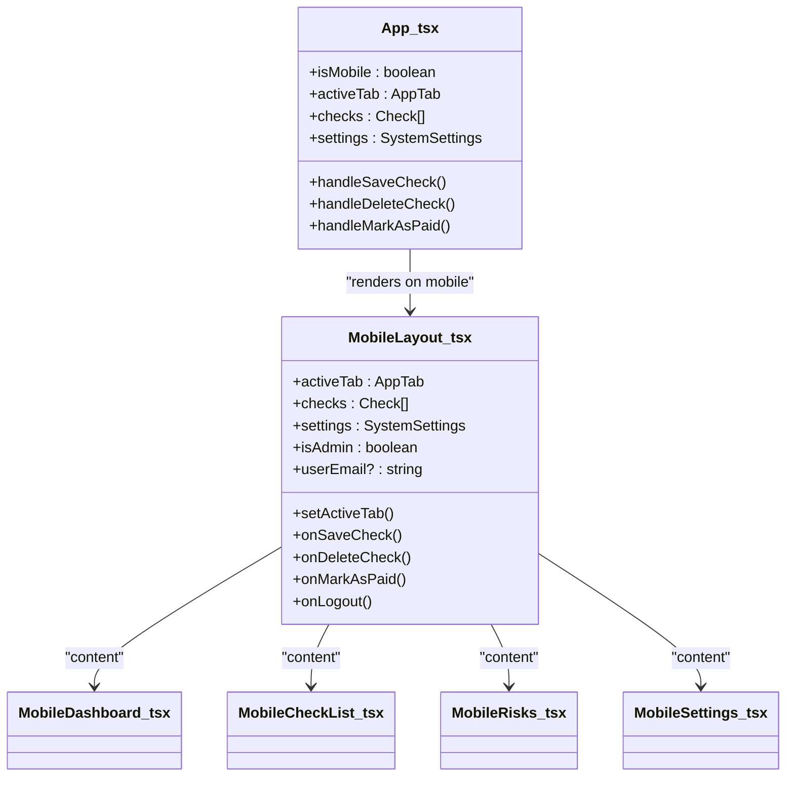
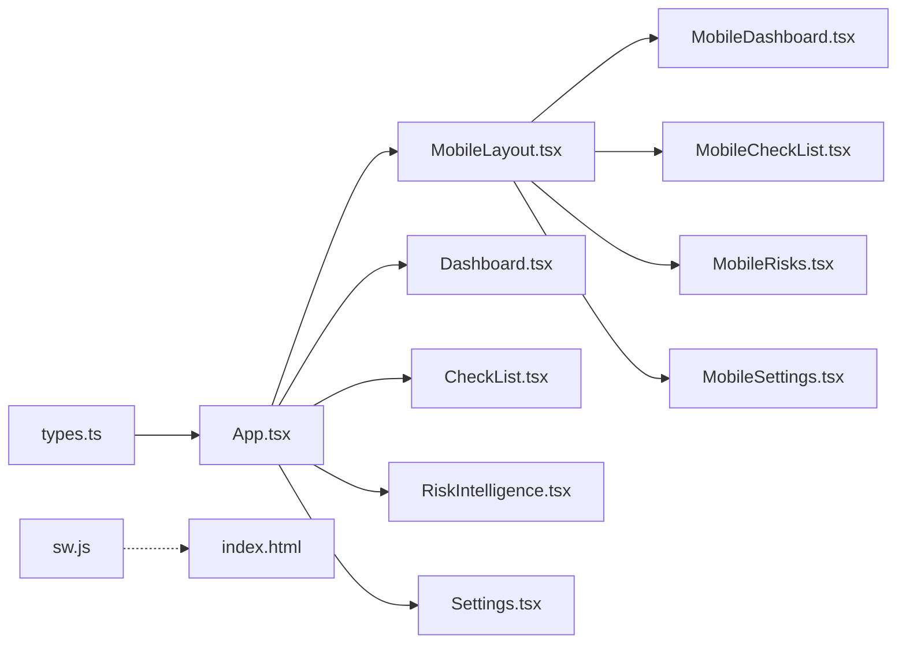

# Mobile Components

<cite>
**Referenced Files in This Document**
- [App.tsx](file://App.tsx)
- [MobileLayout.tsx](file://mobile/MobileLayout.tsx)
- [MobileDashboard.tsx](file://mobile/MobileDashboard.tsx)
- [MobileCheckList.tsx](file://mobile/MobileCheckList.tsx)
- [MobileRisks.tsx](file://mobile/MobileRisks.tsx)
- [MobileSettings.tsx](file://mobile/MobileSettings.tsx)
- [Dashboard.tsx](file://components/Dashboard.tsx)
- [CheckList.tsx](file://components/CheckList.tsx)
- [RiskIntelligence.tsx](file://components/RiskIntelligence.tsx)
- [Settings.tsx](file://components/Settings.tsx)
- [types.ts](file://types.ts)
- [sw.js](file://sw.js)
- [index.html](file://index.html)
- [package.json](file://package.json)
- [vite.config.ts](file://vite.config.ts)
</cite>

## Table of Contents
1. [Introduction](#introduction)
2. [Project Structure](#project-structure)
3. [Core Components](#core-components)
4. [Architecture Overview](#architecture-overview)
5. [Detailed Component Analysis](#detailed-component-analysis)
6. [Dependency Analysis](#dependency-analysis)
7. [Performance Considerations](#performance-considerations)
8. [Troubleshooting Guide](#troubleshooting-guide)
9. [Conclusion](#conclusion)

## Introduction
This document focuses on the mobile-optimized components of GestionCh-ques, detailing how the application adapts its user interface and interactions for small screens and touch-first environments. It explains the responsive architecture centered on a bottom navigation layout, the mobile-specific implementations of key screens (Dashboard, Checklist, Risk Intelligence, Settings), and the Progressive Web App (PWA) layer that enables an app-like experience with offline readiness. It also compares the mobile and desktop implementations to show how shared functionality is reused while tailoring UI and UX for different form factors.

## Project Structure
The mobile experience is implemented under a dedicated folder and integrates with the existing desktop components via a single entry point that detects device form factor and renders the appropriate layout.

**Diagram sources**
- [App.tsx:256-274](file://App.tsx#L256-L274)
- [MobileLayout.tsx:10-13](file://mobile/MobileLayout.tsx#L10-L13)
- [Dashboard.tsx:1-206](file://components/Dashboard.tsx#L1-L206)
- [CheckList.tsx:1-350](file://components/CheckList.tsx#L1-L350)
- [RiskIntelligence.tsx:1-141](file://components/RiskIntelligence.tsx#L1-L141)
- [Settings.tsx:1-196](file://components/Settings.tsx#L1-L196)
- [sw.js:70-76](file://sw.js#L70-L76)
- [index.html:66-78](file://index.html#L66-L78)

**Section sources**
- [App.tsx:47-86](file://App.tsx#L47-L86)
- [index.html:66-78](file://index.html#L66-L78)

## Core Components
- MobileLayout: Provides a bottom tab bar with integrated floating action button, routes content to mobile-specific screens, and manages a global modal for adding/editing checks.
- MobileDashboard: Touch-optimized summary cards, filter controls, and paginated list tailored for small screens.
- MobileCheckList: Search-focused list with contextual action overlays and simplified actions for touch targets.
- MobileRisks: Real-time risk score, vulnerability signals, and strategic intelligence report optimized for quick scanning.
- MobileSettings: Compact settings presentation and logout affordance.

These components share data and callbacks with the desktop counterparts but adapt UI patterns for mobile: larger touch targets, simplified controls, and bottom navigation.

**Section sources**
- [MobileLayout.tsx:28-162](file://mobile/MobileLayout.tsx#L28-L162)
- [MobileDashboard.tsx:21-259](file://mobile/MobileDashboard.tsx#L21-L259)
- [MobileCheckList.tsx:15-100](file://mobile/MobileCheckList.tsx#L15-L100)
- [MobileRisks.tsx:25-241](file://mobile/MobileRisks.tsx#L25-L241)
- [MobileSettings.tsx:12-67](file://mobile/MobileSettings.tsx#L12-L67)

## Architecture Overview
The runtime chooses between mobile and desktop views based on viewport width. On mobile, MobileLayout orchestrates tabs and a central add-check action, delegating content rendering to specialized mobile screens. Desktop components remain unchanged and are used for non-mobile form factors.

**Diagram sources**
- [App.tsx:256-274](file://App.tsx#L256-L274)
- [MobileLayout.tsx:44-84](file://mobile/MobileLayout.tsx#L44-L84)
- [MobileLayout.tsx:130-136](file://mobile/MobileLayout.tsx#L130-L136)

**Section sources**
- [App.tsx:32-86](file://App.tsx#L32-L86)
- [MobileLayout.tsx:28-162](file://mobile/MobileLayout.tsx#L28-L162)

## Detailed Component Analysis

### MobileLayout: Bottom Navigation and Touch-Optimized Interactions
- Bottom navigation bar with four tabs: Home (dashboard), Checks, Risks, and a central floating Add action.
- Tab selection updates state and switches content without page reload.
- Central plus button opens a modal for adding or editing checks; editing state is derived from selected item.
- Restricted user visibility: Home tab hidden for a specific user role.
- Sticky header with branding and live indicator; main content area scrollable and padded for safe area.

**Diagram sources**
- [MobileLayout.tsx:44-84](file://mobile/MobileLayout.tsx#L44-L84)
- [MobileLayout.tsx:130-156](file://mobile/MobileLayout.tsx#L130-L156)

**Section sources**
- [MobileLayout.tsx:28-162](file://mobile/MobileLayout.tsx#L28-L162)

### MobileDashboard: Touch-Friendly Summary and Filters
- Horizontal time-range selector with reset control.
- Type toggles (incoming/outgoing) and status chips for filtering.
- Summary cards for financial metrics with subtle animations.
- Paginated list of checks with large, tappable rows and chevron indicators.
- Items-per-page selector and pagination controls optimized for thumb-friendly taps.

**Diagram sources**
- [MobileDashboard.tsx:32-78](file://mobile/MobileDashboard.tsx#L32-L78)
- [MobileDashboard.tsx:167-200](file://mobile/MobileDashboard.tsx#L167-L200)
- [MobileDashboard.tsx:214-251](file://mobile/MobileDashboard.tsx#L214-L251)

**Section sources**
- [MobileDashboard.tsx:21-259](file://mobile/MobileDashboard.tsx#L21-L259)

### MobileCheckList: Search and Action Overlays
- Sticky search bar with prominent icon and placeholder.
- Card-based list entries with status badges and compact typography.
- Long-press or tap to reveal floating action overlay with Edit, Mark As Paid (when applicable), and Delete actions.
- Minimal table-like layout adapted to cards for mobile.

**Diagram sources**
- [MobileCheckList.tsx:19-22](file://mobile/MobileCheckList.tsx#L19-L22)
- [MobileCheckList.tsx:73-91](file://mobile/MobileCheckList.tsx#L73-L91)

**Section sources**
- [MobileCheckList.tsx:15-100](file://mobile/MobileCheckList.tsx#L15-L100)

### MobileRisks: Risk Score and Intelligence Report
- Real-time risk score with animated progress bar and color-coded severity.
- Primary metrics grid for exposure and returned checks.
- Vulnerability signals list with actionable items; tapping navigates to related check.
- Strategic intelligence report with liquidity diagnostics, exposure advice, and AI recommendation.

**Diagram sources**
- [MobileRisks.tsx:26-109](file://mobile/MobileRisks.tsx#L26-L109)
- [MobileRisks.tsx:166-182](file://mobile/MobileRisks.tsx#L166-L182)

**Section sources**
- [MobileRisks.tsx:25-241](file://mobile/MobileRisks.tsx#L25-L241)

### MobileSettings: Compact Presentation and Logout
- Company info card with currency and privilege display.
- Logout button styled as a prominent action.
- Version and security notice for transparency.

**Section sources**
- [MobileSettings.tsx:12-67](file://mobile/MobileSettings.tsx#L12-L67)

### Relationship Between Mobile and Desktop Components
- App.tsx detects mobile vs desktop and renders either MobileLayout or the desktop suite of components.
- Mobile components reuse shared types and data structures, while desktop components remain unchanged.
- Desktop components expose the same props and callbacks used by the mobile layout’s event handlers (e.g., save/delete/mark-as-paid), ensuring consistent behavior across form factors.

**Diagram sources**
- [App.tsx:256-274](file://App.tsx#L256-L274)
- [MobileLayout.tsx:28-162](file://mobile/MobileLayout.tsx#L28-L162)

**Section sources**
- [App.tsx:32-86](file://App.tsx#L32-L86)
- [Dashboard.tsx:20-25](file://components/Dashboard.tsx#L20-L25)
- [CheckList.tsx:7-17](file://components/CheckList.tsx#L7-L17)
- [RiskIntelligence.tsx:12-17](file://components/RiskIntelligence.tsx#L12-L17)
- [Settings.tsx:6-9](file://components/Settings.tsx#L6-L9)

## Dependency Analysis
- Runtime routing: App.tsx decides between mobile and desktop views based on window width.
- Shared types: types.ts defines enums and interfaces used by both mobile and desktop components.
- PWA layer: sw.js caches a minimal set of assets; index.html registers the service worker and sets PWA-related meta tags.

**Diagram sources**
- [types.ts:1-77](file://types.ts#L1-L77)
- [App.tsx:12-13](file://App.tsx#L12-L13)
- [sw.js:1-28](file://sw.js#L1-L28)
- [index.html:66-78](file://index.html#L66-L78)

**Section sources**
- [types.ts:1-77](file://types.ts#L1-L77)
- [App.tsx:12-13](file://App.tsx#L12-L13)
- [sw.js:1-28](file://sw.js#L1-L28)
- [index.html:66-78](file://index.html#L66-L78)

## Performance Considerations
- Rendering and memory:
  - Mobile components use lightweight cards and minimal DOM nesting to reduce layout thrash on low-power devices.
  - Memoization of computed data (e.g., stats and risk analysis) prevents unnecessary re-renders.
- Touch interactions:
  - Large hit areas for buttons and tabs improve accuracy and reduce accidental taps.
  - Reduced animations and transitions on mobile compared to desktop to preserve battery life.
- Network efficiency:
  - PWA caching strategy prioritizes critical assets; consider expanding cache to JS/CSS bundles for offline resilience.
  - Debounce or throttle search/filter operations to avoid excessive recomputation during typing.
- Battery optimization:
  - Avoid frequent polling; rely on visibility change and explicit refresh triggers.
  - Minimize heavy computations in render paths; offload to background tasks when possible.
- Storage and persistence:
  - Local storage keys are used for persisted UI state; ensure minimal payload to avoid blocking the main thread.

[No sources needed since this section provides general guidance]

## Troubleshooting Guide
- Service worker not registering:
  - Verify HTTPS or localhost; ensure the script runs after DOM load and that the path to sw.js is correct.
- Offline behavior:
  - Current cache includes only a small subset of assets; add commonly used JS/CSS resources to improve offline reliability.
- Bottom navigation not visible:
  - Confirm viewport meta tag is present and that the device width threshold is met.
- Restricted user cannot access dashboard:
  - The mobile layout hides the Home tab for specific user emails; verify user role and email mapping.

**Section sources**
- [sw.js:70-76](file://sw.js#L70-L76)
- [index.html:66-78](file://index.html#L66-L78)
- [MobileLayout.tsx:44-48](file://mobile/MobileLayout.tsx#L44-L48)

## Conclusion
The mobile-optimized implementation of GestionCh-ques centers on a streamlined bottom navigation layout and screen-specific components designed for touch interactions and constrained real estate. By sharing data models and callbacks with desktop components, the system maintains consistency while delivering a tailored experience. The PWA layer enhances the app-like quality with caching and registration, and future enhancements can expand offline capabilities and refine performance for diverse mobile environments.