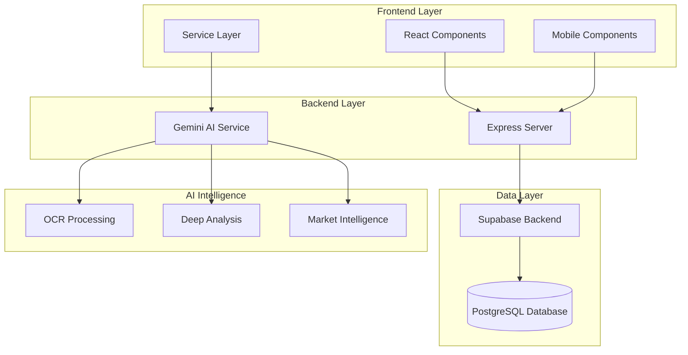
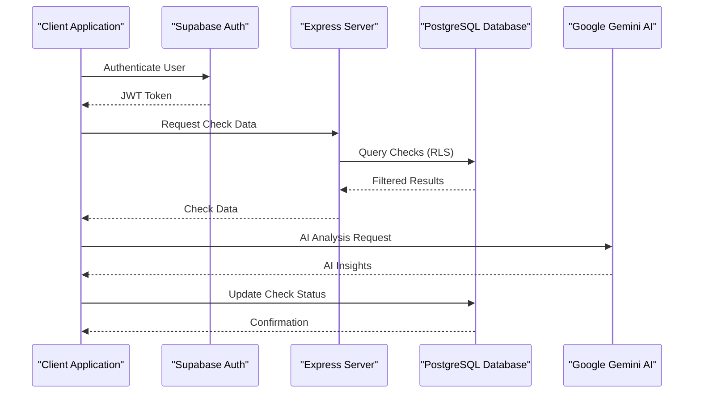
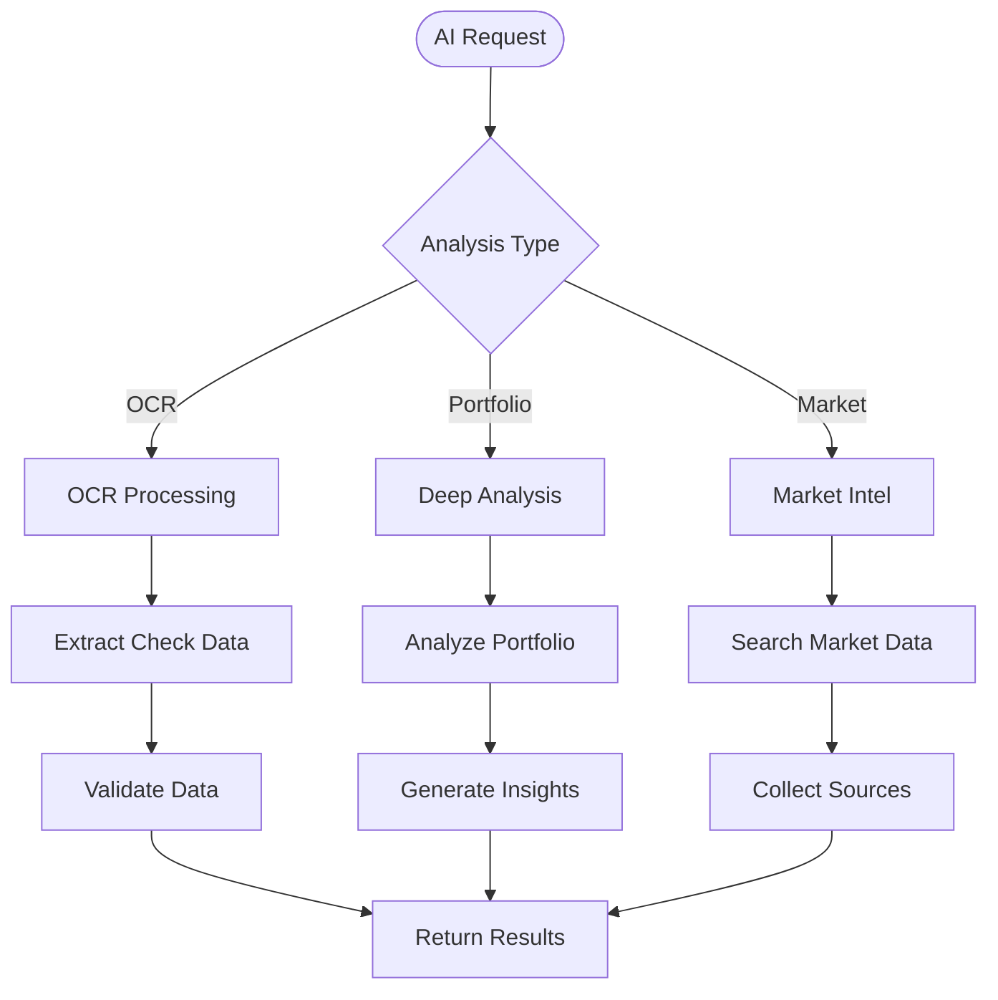
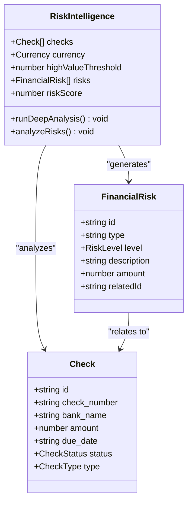
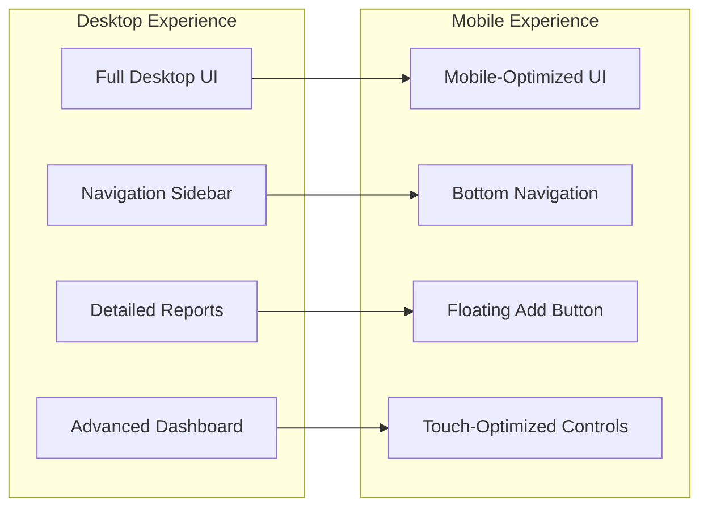

# Project Overview

<cite>
**Referenced Files in This Document**
- [README.md](file://README.md)
- [package.json](file://package.json)
- [App.tsx](file://App.tsx)
- [supabase.ts](file://supabase.ts)
- [server.js](file://server.js)
- [geminiService.ts](file://services/geminiService.ts)
- [types.ts](file://types.ts)
- [RiskIntelligence.tsx](file://components/RiskIntelligence.tsx)
- [Dashboard.tsx](file://components/Dashboard.tsx)
- [MobileLayout.tsx](file://mobile/MobileLayout.tsx)
- [constants.tsx](file://constants.tsx)
- [setup.sql](file://setup.sql)
</cite>

## Table of Contents
1. [Introduction](#introduction)
2. [Project Structure](#project-structure)
3. [Core Components](#core-components)
4. [Architecture Overview](#architecture-overview)
5. [Detailed Component Analysis](#detailed-component-analysis)
6. [Dependency Analysis](#dependency-analysis)
7. [Performance Considerations](#performance-considerations)
8. [Troubleshooting Guide](#troubleshooting-guide)
9. [Conclusion](#conclusion)

## Introduction
GestionCh-ques is a premium financial management system designed specifically for tracking and managing check instruments with AI-powered intelligence features. The platform provides real-time check tracking, AI-driven market intelligence, advanced risk assessment capabilities, and a cross-platform responsive design tailored for financial professionals.

The system serves as a modern solution for financial managers, accountants, and businesses that handle significant volumes of check transactions. It combines traditional check management workflows with cutting-edge artificial intelligence to deliver predictive insights, automated risk detection, and intelligent market analysis.

## Project Structure
The application follows a modern React-based architecture with TypeScript, integrated with Supabase for authentication and database management, and powered by Google Gemini AI for intelligent features. The project is organized into distinct layers:



**Diagram sources**
- [App.tsx:1-406](file://App.tsx#L1-L406)
- [server.js:1-101](file://server.js#L1-L101)
- [supabase.ts:1-23](file://supabase.ts#L1-L23)
- [geminiService.ts:1-138](file://services/geminiService.ts#L1-L138)

**Section sources**
- [package.json:1-30](file://package.json#L1-L30)
- [App.tsx:1-406](file://App.tsx#L1-L406)
- [server.js:1-101](file://server.js#L1-L101)

## Core Components
The system comprises several key components that work together to provide comprehensive check management and AI-powered intelligence:

### Authentication and Session Management
The application uses Supabase for secure authentication and session persistence. The authentication system supports multiple user roles with granular access controls, enabling both individual users and administrative oversight.

### Real-Time Data Synchronization
The frontend maintains real-time synchronization with the backend through Supabase's real-time capabilities, ensuring that check data updates are reflected immediately across all connected devices.

### AI-Powered Intelligence Features
The system integrates Google Gemini AI for three primary functions:
- **OCR Data Extraction**: Automated check image processing for quick data entry
- **Deep Portfolio Analysis**: Strategic financial analysis and risk assessment
- **Market Intelligence**: Current exchange rates and financial news integration

### Cross-Platform Responsive Design
The application provides seamless experiences across desktop and mobile platforms, with specialized mobile layouts optimized for touch interactions and simplified navigation.

**Section sources**
- [supabase.ts:1-23](file://supabase.ts#L1-L23)
- [App.tsx:111-178](file://App.tsx#L111-L178)
- [geminiService.ts:1-138](file://services/geminiService.ts#L1-L138)
- [MobileLayout.tsx:1-162](file://mobile/MobileLayout.tsx#L1-L162)

## Architecture Overview
The system employs a modern microservice architecture with clear separation of concerns:



**Diagram sources**
- [App.tsx:122-168](file://App.tsx#L122-L168)
- [supabase.ts:12-22](file://supabase.ts#L12-L22)
- [server.js:14-100](file://server.js#L14-L100)
- [geminiService.ts:63-96](file://services/geminiService.ts#L63-L96)

The architecture ensures data security through row-level security policies, efficient caching mechanisms, and scalable backend services.

**Section sources**
- [setup.sql:37-60](file://setup.sql#L37-L60)
- [App.tsx:122-168](file://App.tsx#L122-L168)
- [server.js:17-85](file://server.js#L17-L85)

## Detailed Component Analysis

### AI Intelligence Engine
The Gemini AI integration provides three primary capabilities:



**Diagram sources**
- [geminiService.ts:9-58](file://services/geminiService.ts#L9-L58)
- [geminiService.ts:63-96](file://services/geminiService.ts#L63-L96)
- [geminiService.ts:101-137](file://services/geminiService.ts#L101-L137)

The OCR functionality processes check images to extract structured data, while the portfolio analysis provides strategic financial insights. Market intelligence delivers current exchange rates and relevant financial news.

**Section sources**
- [geminiService.ts:1-138](file://services/geminiService.ts#L1-L138)
- [RiskIntelligence.tsx:19-51](file://components/RiskIntelligence.tsx#L19-L51)
- [Dashboard.tsx:27-40](file://components/Dashboard.tsx#L27-L40)

### Risk Assessment System
The risk intelligence component provides comprehensive risk analysis with multiple detection mechanisms:



**Diagram sources**
- [types.ts:26-33](file://types.ts#L26-L33)
- [RiskIntelligence.tsx:12-17](file://RiskIntelligence.tsx#L12-L17)
- [types.ts:45-60](file://types.ts#L45-L60)

The system detects critical issues like returned checks, overdue payments, and high-value exposures, providing both immediate alerts and strategic recommendations.

**Section sources**
- [RiskIntelligence.tsx:30-51](file://components/RiskIntelligence.tsx#L30-L51)
- [types.ts:26-33](file://types.ts#L26-L33)

### Cross-Platform Design System
The responsive design architecture ensures optimal user experience across all device types:



**Diagram sources**
- [App.tsx:256-274](file://App.tsx#L256-L274)
- [MobileLayout.tsx:86-158](file://mobile/MobileLayout.tsx#L86-L158)

The mobile layout features a simplified navigation system with integrated action buttons and optimized touch interactions.

**Section sources**
- [App.tsx:47-86](file://App.tsx#L47-L86)
- [MobileLayout.tsx:1-162](file://mobile/MobileLayout.tsx#L1-L162)

## Dependency Analysis
The project leverages a carefully selected technology stack optimized for performance and scalability:

```mermaid
graph TB
subgraph "Frontend Dependencies"
React[React 19.2.4]
TS[TypeScript]
Lucide[Lucide React Icons]
Recharts[Recharts 3.7.0]
end
subgraph "Backend Dependencies"
Express[Express 4.21.2]
Supabase[Supabase JS 2.48.1]
Gemini[Google GenAI 1.42.0]
Dotenv[Dotenv 17.2.4]
end
subgraph "Development Tools"
Vite[Vite 7.3.1]
Sucrase[Sucrase 3.35.0]
ReactPlugin[@vitejs/plugin-react]
end
React --> Express
Supabase --> Gemini
Express --> Vite
React --> Supabase
```

**Diagram sources**
- [package.json:13-28](file://package.json#L13-L28)

The dependency structure supports rapid development cycles while maintaining production-ready performance characteristics.

**Section sources**
- [package.json:1-30](file://package.json#L1-L30)
- [server.js:2-8](file://server.js#L2-L8)

## Performance Considerations
The system incorporates several performance optimization strategies:

- **In-Memory Transpilation Cache**: The Express server caches transpiled TypeScript/JSX code to reduce load times
- **Real-Time Data Synchronization**: Supabase's real-time subscriptions minimize polling overhead
- **Responsive Design**: Mobile-first approach reduces unnecessary DOM manipulation
- **Environment Variable Injection**: Build-time injection of configuration values eliminates runtime lookups

## Troubleshooting Guide
Common issues and their solutions:

### Authentication Problems
- Verify Supabase credentials are properly configured
- Check browser console for authentication errors
- Ensure proper CORS configuration for cross-origin requests

### AI Service Issues
- Confirm API key is properly set in environment variables
- Monitor quota limits for Google Gemini API usage
- Check network connectivity for external API calls

### Database Connectivity
- Verify PostgreSQL connection string and credentials
- Check row-level security policies for proper access
- Monitor database query performance and optimize as needed

**Section sources**
- [README.md:16-20](file://README.md#L16-L20)
- [geminiService.ts:10-13](file://services/geminiService.ts#L10-L13)
- [setup.sql:37-60](file://setup.sql#L37-L60)

## Conclusion
GestionCh-ques represents a sophisticated solution for modern check instrument management, combining traditional financial workflows with cutting-edge AI capabilities. The system's strength lies in its comprehensive approach to financial management, offering real-time tracking, intelligent risk assessment, and strategic market insights through a unified, responsive interface.

The platform's competitive advantages include its specialized focus on check management, robust AI integration, enterprise-grade security through Supabase, and seamless cross-platform experience. By targeting financial managers, accountants, and businesses handling significant check volumes, the system addresses a specific market need with innovative technology solutions.

The modular architecture ensures scalability and maintainability, while the responsive design accommodates diverse user workflows across desktop and mobile environments. This foundation positions GestionCh-ques as a premier solution in the specialized check instrument management space.